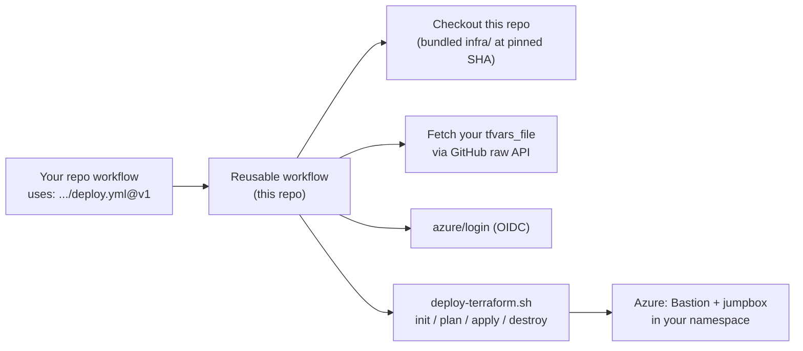

# action-deployer-vm-bastion-alz

A reusable GitHub Actions workflow that deploys an **Azure Bastion + Linux jumpbox**
into the BC Gov Azure Landing Zone, following ALZ policy and security best practices
(OIDC auth, no public IPs on the VM, no SSH keys, Entra ID + MFA login).

The Terraform that builds the Bastion, jumpbox, RBAC, schedules, monitoring and
Bastion automation is **bundled in this repo** under [`infra/`](infra/). Consuming
teams do not copy any Terraform: they call the reusable workflow, pass a few inputs
(or a `.tfvars` file), and the deployment lands in **their** subscription / namespace.

## How it works



The workflow checks out **only this repo** (the bundled Terraform, pinned to the
exact workflow commit). Your `tfvars_file` is pulled directly from **your** repo
over the GitHub raw API at the triggering ref — no full checkout of your repo is
needed. It then runs OIDC login and the bundled `deploy-terraform.sh` against an
`azurerm` remote-state backend you own.

## Quick start

### Initial setup (one-time, per environment)

Before the workflow can authenticate, run the BC Gov Azure Landing Zone OIDC
bootstrap **in your own repo/subscription**. It creates a user-assigned managed
identity, an **environment-scoped** OIDC federated credential, the Terraform
state storage account, and (optionally) the GitHub Environment plus its secrets
and the `STORAGE_ACCOUNT_NAME` variable:

```bash
curl -sSLO https://raw.githubusercontent.com/bcgov/quickstart-azure-containers/refs/heads/main/initial-azure-setup.sh
chmod +x initial-azure-setup.sh

# Preview first (recommended), then run for real per environment:
./initial-azure-setup.sh -g "<LICENSEPLATE>-dev-networking" -n "my-app-dev-identity" \
  -r "bcgov/my-app" -e "dev" --create-storage --create-github-secrets --dry-run
```

What it sets up for each environment:

- **OIDC federated credential** with subject `repo:<owner>/<repo>:environment:<env>` —
  i.e. it only trusts a job running in that **GitHub Environment**.
- **Environment secrets**: `AZURE_CLIENT_ID`, `AZURE_TENANT_ID`, `AZURE_SUBSCRIPTION_ID`,
  `VNET_NAME`, `VNET_RESOURCE_GROUP_NAME`.
- **Environment variable**: `STORAGE_ACCOUNT_NAME` (the Terraform state account).

> **You still add manually** (the bootstrap does not create these): the
> `VNET_ADDRESS_SPACE` and `VM_ADMIN_LOGIN_PRINCIPAL_IDS` secrets — **both are
> required**. Add them to the **same GitHub Environment**.

### Wire up the workflow

1. (Optional) Commit a `.tfvars` file — copy [`examples/team.tfvars`](examples/team.tfvars).
2. Add a caller workflow — copy [`examples/caller-deploy.yml`](examples/caller-deploy.yml).

Minimal caller:

```yaml
on:
  workflow_dispatch:
    inputs:
      environment:
        type: choice
        options: [dev, test, prod, tools]

jobs:
  deploy:
    uses: bcgov/action-deployer-vm-bastion-alz/.github/workflows/deploy.yml@v1
    with:
      app_name: my-app
      app_env: ${{ inputs.environment }}
      environment: ${{ inputs.environment }} # selects the GitHub Environment
      tfvars_file: ./config/my-app.tfvars
    secrets: inherit # required so environment-scoped secrets resolve
```

> **Why `secrets: inherit`?** Environment secrets are only visible to a job that
> runs in that environment. A job that *calls* a reusable workflow cannot declare
> `environment:` itself, so mapping secrets explicitly would only see repo/org
> secrets. With `inherit`, the secrets resolve inside the reusable workflow's job,
> which **does** set the environment (from the `environment` input). Caller and
> deployer must be in the same GitHub org for `inherit`.

> **Pin a version.** Reference the workflow with a tag or commit SHA
> (`...deploy.yml@v1`). The reusable workflow checks out its **own** bundled
> `infra/` at that exact commit via `github.job_workflow_sha`, so the Terraform
> always matches the version you pinned — no separate ref input to keep in sync.

## Configuration: tfvars + override inputs

You can configure the deployment two ways, and combine them:

- **`tfvars_file`** — a `.tfvars` file in your repo. The deployer fetches it from
  your repository over the GitHub raw API at the ref that triggered the run
  (`head_ref` on a PR, otherwise `ref_name`, otherwise the default branch) and uses
  it as the base config. The path is relative to your repo root (e.g.
  `config/my-app.tfvars`). For a **private** repo, the calling workflow must grant
  `contents: read` so the automatic `GITHUB_TOKEN` can read the file; the deployer
  validates the URL and fails with a clear hint if it is unreachable.
- **Override inputs** — discrete workflow inputs (`location`, `vm_size`, `bastion_sku`,
  `enable_bastion`, `enable_jumpbox`, `enable_bastion_automation`, `os_disk_size_gb`).

Precedence (highest wins):

```
override inputs (-var)  >  tfvars_file  >  secret-backed TF_VAR_* defaults
```

So an override input always wins over the same key in your tfvars file.

## Network configuration

The deployer creates two subnets inside your **existing** spoke VNet (owned by the
platform team): the jumpbox subnet and `AzureBastionSubnet`. Configure them through
your `tfvars_file`:

| Variable | Default | Notes |
|---|---|---|
| `vnet_name` | — (secret) | Existing spoke VNet. |
| `vnet_resource_group_name` | — (secret) | Resource group of the VNet. |
| `vnet_address_space` | — (secret) | CIDR of the VNet; used to auto-derive subnets. |
| `bastion_subnet_name` | `AzureBastionSubnet` | Must stay `AzureBastionSubnet` (Azure requirement). |
| `jumpbox_subnet_name` | `jumpbox-subnet` | Jumpbox subnet name. |
| `bastion_subnet_address_prefix` | _(derived)_ | Explicit Bastion CIDR. **Must be /26 or larger.** |
| `jumpbox_subnet_address_prefix` | _(derived)_ | Explicit jumpbox CIDR. |

When the subnet prefixes are left empty they are derived from `vnet_address_space`
assuming a **/24 spoke** (`<base>.64/26` for Bastion, `<base>.128/28` for the
jumpbox). For any other VNet size, set both prefixes explicitly.

> **Validation.** Terraform rejects the deploy if `bastion_subnet_address_prefix`
> is smaller than /26 (Azure Bastion requires at least a /26), if any subnet/VNet
> value is not a valid CIDR, or if `bastion_subnet_name` is changed away from
> `AzureBastionSubnet`.

## Inputs

| Input | Required | Default | Description |
|---|---|---|---|
| `app_name` | yes | — | Application name; used for resource naming and the state key. |
| `app_env` | yes | — | Environment (e.g. `tools`, `dev`, `test`, `prod`). |
| `terraform_command` | no | `apply` | `apply`, `plan`, or `destroy`. |
| `environment` | no | `app_env` | GitHub Environment for approvals / scoped secrets. |
| `tfvars_file` | no | `""` | Path in your repo to a `.tfvars` file. |
| `location` | no | `""` | Azure region override. |
| `resource_group_name` | no | `<app_name>-<app_env>` | Resource group name override. |
| `vm_size` | no | `""` | Jumpbox VM size override. |
| `os_disk_size_gb` | no | `""` | Jumpbox OS disk size override. |
| `bastion_sku` | no | `""` | Bastion SKU override (`Standard`/`Premium`). |
| `enable_bastion` | no | `""` | Deploy Bastion (`true`/`false`). |
| `enable_jumpbox` | no | `""` | Deploy jumpbox (`true`/`false`). |
| `enable_bastion_automation` | no | `""` | Bastion delete/recreate automation (`true`/`false`). |
| `enable_monitoring` | no | `""` | Create/attach a Log Analytics Workspace + Bastion audit logs. Set `false` to skip the workspace entirely. |
| `existing_log_analytics_workspace_id` | no | `""` | BYO Log Analytics Workspace resource ID. When set, no workspace is created. |
| `backend_storage_account` | no | `vars.STORAGE_ACCOUNT_NAME` | Storage account holding Terraform state. Defaults to the environment variable set by the bootstrap. |
| `backend_resource_group` | no | `VNET_RESOURCE_GROUP_NAME` | Resource group of the state storage account. |
| `backend_container_name` | no | `tfstate` | Blob container for state. |
| `backend_state_key` | no | `<app_name>/<app_env>/terraform.tfstate` | State blob key. |
| `runs_on` | no | `ubuntu-24.04` | Runner label. |

## Secrets

Pass these with `secrets: inherit`. The [initial setup](#initial-setup-one-time-per-environment)
script creates most as **environment** secrets. Add `VNET_ADDRESS_SPACE` and
`VM_ADMIN_LOGIN_PRINCIPAL_IDS` to the same GitHub Environment yourself — both are
required.

> **Network details are mandatory secrets by design.** `VNET_NAME`,
> `VNET_RESOURCE_GROUP_NAME`, and `VNET_ADDRESS_SPACE` are required and passed as
> secrets, never as plain inputs or tfvars. This keeps VNet names and IP ranges
> out of workflow logs, PRs, and committed config, and puts the responsibility on
> the calling team to supply (and safeguard) their own network information.

| Secret | Required | Created by bootstrap | Description |
|---|---|---|---|
| `AZURE_CLIENT_ID` | yes | yes | OIDC app (client) ID. |
| `AZURE_TENANT_ID` | yes | yes | Azure AD tenant ID. |
| `AZURE_SUBSCRIPTION_ID` | yes | yes | Target subscription ID. |
| `VNET_NAME` | yes | yes | Existing spoke VNet name (platform team). |
| `VNET_RESOURCE_GROUP_NAME` | yes | yes | Resource group of the existing VNet. |
| `VNET_ADDRESS_SPACE` | yes | no | Address space of the VNet (e.g. `10.46.115.0/24`). Add manually. |
| `VM_ADMIN_LOGIN_PRINCIPAL_IDS` | yes | no | Comma-separated Entra object IDs (users/groups) for jumpbox login. Add manually. See [Jumpbox access](#jumpbox-access-vm-admin-login). |

## Jumpbox access (VM Admin Login)

Entra-SSH access to the jumpbox is gated by Azure RBAC: the deployer assigns the
**Virtual Machine Administrator Login** role to every principal you list in the
`VM_ADMIN_LOGIN_PRINCIPAL_IDS` secret. This is **required** — with an empty list
the role is never assigned and **nobody can log in**, which makes the entire
Bastion + jumpbox path unusable. The deployer fails fast if the secret is empty
or contains a value that is not an object ID.

Format of the `VM_ADMIN_LOGIN_PRINCIPAL_IDS` secret:

- A **comma-separated** string — no brackets, no quotes, e.g.
  `11111111-1111-1111-1111-111111111111,22222222-2222-2222-2222-222222222222`.
- Each value is an Entra **object ID (GUID)** for a **user** or a **group**.
  A group is recommended so you manage who has access in Entra, not in CI.
- Use object IDs, **not** UPNs, emails, or display names — those are rejected.

Find object IDs with the Azure CLI:

```bash
# A user, by sign-in name
az ad user show --id alice@example.gov.bc.ca --query id -o tsv

# A group, by display name
az ad group show --group "My Team Jumpbox Admins" --query id -o tsv
```

Examples of the secret value:

| Grant access to | `VM_ADMIN_LOGIN_PRINCIPAL_IDS` |
|---|---|
| one group (recommended) | `aaaaaaaa-aaaa-aaaa-aaaa-aaaaaaaaaaaa` |
| two users | `1111...-1111,2222...-2222` |
| a group + a break-glass user | `aaaaaaaa-...,99999999-...` |

## Operations

Set `terraform_command` to choose the operation:

- `apply` — create/update (auto-approved in CI).
- `plan` — preview changes only.
- `destroy` — tear down the namespace (auto-approved in CI).

## What gets deployed

| Component | Purpose |
|---|---|
| Azure Bastion (Standard) | Native client tunneling for AAD-authenticated SSH |
| Ubuntu jumpbox VM | Minimal Linux host, no public IP, Entra SSH login |
| RBAC assignments | VM Admin / User Login for configured Entra principals |
| Auto-shutdown / auto-start | DevTest schedule + Automation runbook |
| Log Analytics workspace | **Optional** — created by default for the Bastion audit trail; BYO or disable (see below) |
| Update Manager assessment | Patch compliance visibility |

See [`infra/`](infra/) for the modules (`network`, `bastion`, `jumpbox`,
`monitoring`) and [`infra/variables.tf`](infra/variables.tf) for the full set of
tunable variables.

## Monitoring (optional Log Analytics)

The **only** consumer of the Log Analytics Workspace is the Bastion connection
audit trail (the `BastionAuditLogs` diagnostic category — who connected through
Bastion, to which VM, when). The jumpbox itself ships no monitoring agent. So the
workspace exists purely for that audit trail, and is **not required** for Bastion
or the jumpbox to function. There are three modes:

| Mode | Set | Result |
|---|---|---|
| **Create (default)** | nothing | A workspace `<app_name>-law` is created and receives Bastion audit logs. |
| **Bring your own** | `existing_log_analytics_workspace_id` | No workspace is created; audit logs go to the workspace you pass. |
| **Off** | `enable_monitoring = false` | No workspace and no Bastion diagnostic setting are created. |

BYO example (resource ID, **not** just the workspace GUID):

```hcl
existing_log_analytics_workspace_id = "/subscriptions/<sub>/resourceGroups/<rg>/providers/Microsoft.OperationalInsights/workspaces/<name>"
```

or as a workflow input:

```yaml
with:
  existing_log_analytics_workspace_id: /subscriptions/<sub>/resourceGroups/<rg>/providers/Microsoft.OperationalInsights/workspaces/<name>
```

> **Resource ID, not GUID.** Azure diagnostic settings need the full workspace
> resource ID. Terraform validates the format and fails early if only a bare GUID
> is supplied.
>
> **BYO needs RBAC, not a key.** The deploying OIDC identity must be able to write
> a diagnostic setting targeting the workspace. If the BYO workspace is in another
> resource group or subscription, grant that identity **Monitoring Contributor**
> (or **Log Analytics Contributor**) on the workspace scope. No workspace shared
> key is needed.

## Repository structure

```text
.
├── .github/
│   ├── workflows/
│   │   ├── deploy.yml                 # Reusable workflow (workflow_call)
│   │   └── dependabot-auto-merge.yml  # Auto-approve + merge Dependabot PRs
│   ├── scripts/
│   │   ├── fetch-tfvars.sh            # Pull caller tfvars via GitHub raw API
│   │   ├── run-deploy.sh              # CI entry point (override -vars, runs deploy)
│   │   └── setup-repo-protection.sh   # One-time gh-api repo hardening (admins)
│   └── dependabot.yml
├── infra/                       # Bundled Terraform (Bastion + jumpbox + ...)
│   ├── deploy-terraform.sh      # init/plan/apply/destroy orchestration
│   └── modules/                 # network, bastion, jumpbox, monitoring
├── examples/
│   ├── caller-deploy.yml        # Copy into your repo's workflows
│   └── team.tfvars              # Copy + edit for your config
└── README.md
```

## Admin setup (this repo)

Repository maintainers run a one-time script to enable the merge automation. It
uses the GitHub CLI (`gh`) and requires admin rights on the repo:

```bash
gh auth login
./.github/scripts/setup-repo-protection.sh
```

It enables repo auto-merge (squash-only, delete branch on merge) and applies
branch protection on `main` (1 required approval, linear history, conversation
resolution, no force-push/deletion). Combined with
[`dependabot-auto-merge.yml`](.github/workflows/dependabot-auto-merge.yml), patch
and minor Dependabot PRs are auto-approved and merged once checks pass; majors
wait for a human. Override defaults with env vars, e.g.:

```bash
REVIEW_COUNT=2 REQUIRED_CHECKS="terraform-validate,lint" \
  ./.github/scripts/setup-repo-protection.sh
```

## Local use

The bundled script also runs locally for ad-hoc work:

```bash
cd infra
export BACKEND_RESOURCE_GROUP=... BACKEND_STORAGE_ACCOUNT=... BACKEND_STATE_KEY=...
./deploy-terraform.sh plan
```
