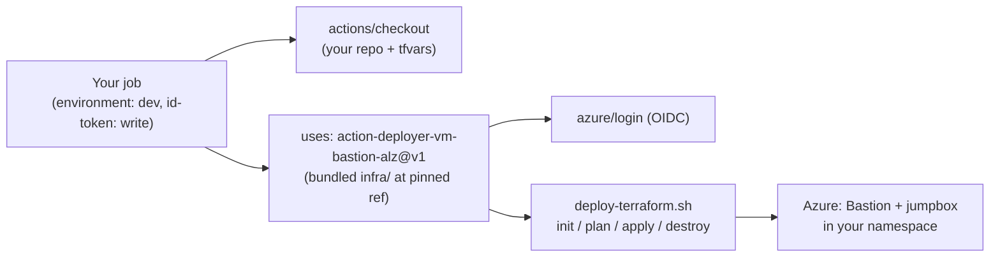

# action-deployer-vm-bastion-alz

A GitHub composite Action that provisions **Azure Bastion + a Linux jumpbox** in your BC Gov Azure Landing Zone namespace — no VPN, no public IPs, no SSH keys. Entra ID with MFA, enforced by Azure RBAC.

The Terraform is bundled in this repo. Your team adds the action as a step, passes a few inputs (or a `.tfvars` file), and the stack lands in your subscription. No Terraform to copy or maintain.

## Table of contents

- [⚠️ One Bastion per VNet](#one-bastion-per-vnet)
- [How it works](#how-it-works)
- [Quick start](#quick-start)
  - [Initial setup (one-time, per environment)](#initial-setup-one-time-per-environment)
  - [Wire up the workflow](#wire-up-the-workflow)
- [Configuration: tfvars + override inputs](#configuration-tfvars--override-inputs)
- [Network configuration](#network-configuration)
- [Inputs](#inputs)
- [Jumpbox access (VM Admin Login)](#jumpbox-access-vm-admin-login)
- [Operations](#operations)
- [What gets deployed](#what-gets-deployed)
- [VM image and placement](#vm-image-and-placement)
- [Start/stop schedules](#startstop-schedules)
- [Bastion session options](#bastion-session-options)
- [Monitoring (optional Log Analytics)](#monitoring-optional-log-analytics)
- [Repository structure](#repository-structure)
- [Admin setup (this repo)](#admin-setup-this-repo)
- [Local deployment](#local-deployment)
  - [One-step local deploy](#one-step-local-deploy)
  - [Prerequisites](#prerequisites)
  - [Required Azure permissions](#required-azure-permissions)
  - [Step-by-step local deployment](#step-by-step-local-deployment)
  - [Local vs GHA differences](#local-vs-gha-differences)
  - [Local tfvars fields](#local-tfvars-fields)
  - [Useful local commands](#useful-local-commands)

<!-- markdownlint-disable-next-line MD033 -->
## <a id="one-bastion-per-vnet"></a>⚠️ One Bastion per VNet

Two hard constraints apply when multiple namespaces share a spoke VNet:

**1. Only one `AzureBastionSubnet` per VNet.** Azure Bastion requires that exact subnet name, and a VNet can only have one. This deployer always creates it. If another namespace already owns it in the same VNet, the deploy fails — the only fix is a separate spoke VNet. (In BC Gov ALZ, each license plate gets its own VNet, so this is rarely an issue.)

**2. Jumpbox subnet names must be unique per VNet.** The default is `jumpbox-subnet`. If another namespace already claimed that name, override it:

```yaml
# In the caller workflow:
- uses: bcgov/action-deployer-vm-bastion-alz@v1
  with:
    jumpbox_subnet_name: myapp-jumpbox-subnet   # unique per namespace
    ...
```

or in your `tfvars_file`:

```hcl
jumpbox_subnet_name = "myapp-jumpbox-subnet"
```

## How it works


```mermaid
flowchart LR
  job["Your job<br/>(environment: dev, id-token: write)"] --> co["actions/checkout<br/>(your repo + tfvars)"]
  job --> act["uses: action-deployer-vm-bastion-alz@v1<br/>(bundled infra/ at pinned ref)"]
  act --> oidc["azure/login (OIDC)"]
  act --> tf["deploy-terraform.sh<br/>init / plan / apply / destroy"]
  tf --> az["Azure: Bastion + jumpbox<br/>in your namespace"]
```

Your job checks out your repo so the action can read your `tfvars_file`, then runs the action as a step. The bundled `infra/` ships at the exact `@ref` you pin — no second checkout needed. The step inherits your job's `environment:` and `id-token` permission, so environment-scoped secrets resolve normally. It logs in with OIDC and runs `deploy-terraform.sh` against a remote state backend in your subscription.

## Quick start

### Initial setup (one-time, per environment)

Run the BC Gov ALZ OIDC bootstrap **once per environment** in your own repo/subscription. It creates the managed identity, OIDC federated credential, Terraform state storage account, and (optionally) the GitHub Environment with secrets and the `STORAGE_ACCOUNT_NAME` variable:

```bash
curl -sSLO https://raw.githubusercontent.com/bcgov/quickstart-azure-containers/refs/heads/main/initial-azure-setup.sh
chmod +x initial-azure-setup.sh

# Preview first (recommended), then run for real per environment:
./initial-azure-setup.sh -g "<LICENSEPLATE>-dev-networking" -n "my-app-dev-identity" \
  -r "bcgov/my-app" -e "dev" --create-storage --create-github-secrets --dry-run
```

What it creates:

- **OIDC federated credential** scoped to `repo:<owner>/<repo>:environment:<env>` — only jobs running in that GitHub Environment can authenticate.
- **Environment secrets**: `AZURE_CLIENT_ID`, `AZURE_TENANT_ID`, `AZURE_SUBSCRIPTION_ID`, `VNET_NAME`, `VNET_RESOURCE_GROUP_NAME`.
- **Environment variable**: `STORAGE_ACCOUNT_NAME` (the Terraform state storage account).

> **Add these four secrets manually** — the bootstrap doesn't create them: `VNET_ADDRESS_SPACE`, `BASTION_SUBNET_ADDRESS_PREFIX`, `JUMPBOX_SUBNET_ADDRESS_PREFIX`, and `VM_ADMIN_LOGIN_PRINCIPAL_IDS`. All four are required. Add them to the same GitHub Environment.

### Wire up the workflow

1. (Optional) Commit a `.tfvars` file — copy [`examples/team.tfvars`](examples/team.tfvars).
2. Add a caller workflow — copy [`examples/caller-deploy.yml`](examples/caller-deploy.yml).

Minimal caller:

```yaml
on:
  workflow_dispatch:
    inputs:
      environment:
        type: choice
        options: [dev, test, prod, tools]

jobs:
  deploy:
    runs-on: ubuntu-24.04
    environment: ${{ inputs.environment }} # selects the GitHub Environment
    permissions:
      id-token: write # OIDC
      contents: read
    steps:
      - uses: actions/checkout@v6 # needed so the action can read tfvars_file
      - uses: bcgov/action-deployer-vm-bastion-alz@v1
        with:
          app_name: my-app
          app_env: ${{ inputs.environment }}
          tfvars_file: ./config/my-app.tfvars
          backend_storage_account: ${{ vars.STORAGE_ACCOUNT_NAME }}
          azure_client_id: ${{ secrets.AZURE_CLIENT_ID }}
          azure_tenant_id: ${{ secrets.AZURE_TENANT_ID }}
          azure_subscription_id: ${{ secrets.AZURE_SUBSCRIPTION_ID }}
          vnet_name: ${{ secrets.VNET_NAME }}
          vnet_resource_group_name: ${{ secrets.VNET_RESOURCE_GROUP_NAME }}
          vnet_address_space: ${{ secrets.VNET_ADDRESS_SPACE }}
          bastion_subnet_address_prefix: ${{ secrets.BASTION_SUBNET_ADDRESS_PREFIX }}
          jumpbox_subnet_address_prefix: ${{ secrets.JUMPBOX_SUBNET_ADDRESS_PREFIX }}
          vm_admin_login_principal_ids: ${{ secrets.VM_ADMIN_LOGIN_PRINCIPAL_IDS }}
```

> **`environment:` goes on the job, not the action.** That's what enables OIDC trust and environment-scoped secrets. Grant `permissions: id-token: write` on the job too. Secret values passed as `with:` inputs are masked in logs.
>
> **Pin a version** with a tag or SHA (`...@v1`). The bundled Terraform ships at that exact ref, so plan and apply always use consistent code.

Once infrastructure is deployed, see the [SOCKS proxy consumer guide](bastion-consumer-scripts/bastion-proxy.md) for instructions on connecting to the private network without a VPN.

## Configuration: tfvars + override inputs

Two ways to configure a deployment — mix and match:

- **`tfvars_file`** — a `.tfvars` file in your checked-out repo (e.g. `config/my-app.tfvars`). The base config. The action fails clearly if the path doesn't exist, usually because `actions/checkout` is missing.
- **Override inputs** — a small set of common knobs: `location`, `vm_size`, `bastion_sku`, `enable_bastion`, `enable_jumpbox`, `enable_bastion_automation`, `os_disk_size_gb`. These always win over the same key in your tfvars.

Precedence: `override inputs > tfvars_file > TF_VAR_* defaults`

For anything beyond the basics, use `tfvars_file`. The action inputs cover only the most common settings — the full variable set lives in [`infra/variables.tf`](infra/variables.tf) and is only reachable through tfvars. Schedule timing, for example, has no action input at all.

## Network configuration

The deployer creates two subnets inside your **existing** spoke VNet (owned by the
platform team): a jumpbox subnet and `AzureBastionSubnet`. Both are always created —
`enable_bastion: false` skips the Bastion host resource but not the subnet.

| Variable | Required | Notes |
| --- | --- | --- |
| `vnet_name` | yes (secret) | Existing spoke VNet. |
| `vnet_resource_group_name` | yes (secret) | Resource group of the VNet. |
| `vnet_address_space` | yes (secret) | CIDR of the VNet. |
| `bastion_subnet_address_prefix` | yes (secret) | CIDR for `AzureBastionSubnet`. **Must be /26 or larger.** |
| `jumpbox_subnet_address_prefix` | yes (secret) | CIDR for the jumpbox subnet. |
| `bastion_subnet_name` | no | Must stay `AzureBastionSubnet` (Azure requirement). |
| `jumpbox_subnet_name` | no | Defaults to `jumpbox-subnet`. **Set a unique value per namespace.** |

> **Validation.** Terraform checks that `bastion_subnet_address_prefix` is /26 or larger, all CIDRs are valid, `bastion_subnet_name` stays `AzureBastionSubnet`, and both subnet prefixes fit inside `vnet_address_space` as Azure reports it. Stale secrets and out-of-range CIDRs fail at `plan`, not mid-apply.

## Inputs

All inputs are passed via `with:`. Values for `azure_*`, `vnet_*`, and
`vm_admin_login_principal_ids` should come from **secrets** (they are masked in
logs); `backend_storage_account` typically comes from the `STORAGE_ACCOUNT_NAME`
variable created by the bootstrap.

| Input | Required | Default | Description |
| --- | --- | --- | --- |
| `app_name` | yes | — | Application name; used for resource naming and the state key. |
| `app_env` | yes | — | Environment (e.g. `tools`, `dev`, `test`, `prod`). |
| `terraform_command` | no | `apply` | `apply`, `plan`, or `destroy`. |
| `tfvars_file` | no | `""` | Path in your checked-out repo to a `.tfvars` file. |
| `location` | no | `""` | Azure region override. |
| `resource_group_name` | no | `<app_name>-<app_env>` | Resource group name override. |
| `vm_size` | no | `""` | Jumpbox VM size override. |
| `os_disk_size_gb` | no | `""` | Jumpbox OS disk size override. |
| `bastion_sku` | no | `""` | Bastion SKU override (`Standard`/`Premium`). |
| `jumpbox_subnet_name` | no | `jumpbox-subnet` | Name of the jumpbox subnet. **Must be unique within the VNet** — override when another namespace already uses the default name. |
| `enable_bastion` | no | `""` | Deploy Bastion host (`true`/`false`). Note: `AzureBastionSubnet` is always created regardless. |
| `enable_jumpbox` | no | `""` | Deploy jumpbox (`true`/`false`). |
| `enable_bastion_automation` | no | `""` | Bastion delete/recreate automation (`true`/`false`). |
| `enable_monitoring` | no | `""` | Create/attach a Log Analytics Workspace + Bastion audit logs. Set `false` to skip. |
| `existing_log_analytics_workspace_id` | no | `""` | BYO Log Analytics Workspace resource ID. When set, no workspace is created. |
| `backend_storage_account` | yes | — | Storage account for Terraform state. Pass `${{ vars.STORAGE_ACCOUNT_NAME }}`. |
| `backend_resource_group` | no | `vnet_resource_group_name` | Resource group of the state storage account. |
| `backend_container_name` | no | `tfstate` | Blob container for state. |
| `backend_state_key` | no | `<app_name>/<app_env>/terraform.tfstate` | State blob key. |
| `azure_client_id` | yes | — | OIDC app (client) ID. Pass from a secret. |
| `azure_tenant_id` | yes | — | Azure AD tenant ID. Pass from a secret. |
| `azure_subscription_id` | yes | — | Target subscription ID. Pass from a secret. |
| `vnet_name` | yes | — | Existing spoke VNet name. Pass from a secret. |
| `vnet_resource_group_name` | yes | — | Resource group of the existing VNet. Pass from a secret. |
| `vnet_address_space` | yes | — | Address space of the VNet (e.g. `10.46.115.0/24`). Pass from a secret. |
| `bastion_subnet_address_prefix` | yes | — | CIDR for `AzureBastionSubnet` (e.g. `10.46.115.64/26`). Must be /26 or larger. Pass from a secret. |
| `jumpbox_subnet_address_prefix` | yes | — | CIDR for the jumpbox subnet (e.g. `10.46.115.128/28`). Pass from a secret. |
| `vm_admin_login_principal_ids` | yes | — | Comma-separated Entra object IDs (users/groups) for jumpbox login. Pass from a secret. See [Jumpbox access](#jumpbox-access-vm-admin-login). |

> **Network inputs should come from secrets**, not committed config. Pass VNet names and CIDRs from GitHub Environment secrets — keep them out of workflow files and committed tfvars.

### Secrets created by the bootstrap

The [initial setup](#initial-setup-one-time-per-environment) script creates these as environment secrets/variables. Map them to action inputs as shown in the caller example:

| GitHub item | Kind | Created by bootstrap | Maps to input |
| --- | --- | --- | --- |
| `AZURE_CLIENT_ID` | secret | yes | `azure_client_id` |
| `AZURE_TENANT_ID` | secret | yes | `azure_tenant_id` |
| `AZURE_SUBSCRIPTION_ID` | secret | yes | `azure_subscription_id` |
| `VNET_NAME` | secret | yes | `vnet_name` |
| `VNET_RESOURCE_GROUP_NAME` | secret | yes | `vnet_resource_group_name` |
| `STORAGE_ACCOUNT_NAME` | variable | yes | `backend_storage_account` |
| `VNET_ADDRESS_SPACE` | secret | **no — add manually** | `vnet_address_space` |
| `BASTION_SUBNET_ADDRESS_PREFIX` | secret | **no — add manually** | `bastion_subnet_address_prefix` |
| `JUMPBOX_SUBNET_ADDRESS_PREFIX` | secret | **no — add manually** | `jumpbox_subnet_address_prefix` |
| `VM_ADMIN_LOGIN_PRINCIPAL_IDS` | secret | **no — add manually** | `vm_admin_login_principal_ids` |

## Jumpbox access (VM Admin Login)

Access to the jumpbox is gated by Azure RBAC. The deployer assigns the **Virtual Machine Administrator Login** role to every principal in `VM_ADMIN_LOGIN_PRINCIPAL_IDS`. This is required — an empty list means nobody can log in. The action fails fast rather than deploying an inaccessible jumpbox.

`VM_ADMIN_LOGIN_PRINCIPAL_IDS` is a **comma-separated string of Entra object IDs** (GUIDs) — users and/or groups, no brackets, no quotes. Use a group so you manage access in Entra, not in CI. Object IDs only — UPNs, emails, and display names are rejected.

Find object IDs with the Azure CLI:

```bash
# A user, by sign-in name
az ad user show --id alice@example.gov.bc.ca --query id -o tsv

# A group, by display name
az ad group show --group "My Team Jumpbox Admins" --query id -o tsv
```

Examples of the secret value:

| Grant access to | `VM_ADMIN_LOGIN_PRINCIPAL_IDS` |
| --- | --- |
| one group (recommended) | `aaaaaaaa-aaaa-aaaa-aaaa-aaaaaaaaaaaa` |
| two users | `1111...-1111,2222...-2222` |
| a group + a break-glass user | `aaaaaaaa-...,99999999-...` |

## Operations

Set `terraform_command` to choose the operation:

- `apply` — create/update (auto-approved in CI).
- `plan` — preview changes only.
- `destroy` — tear down the namespace (auto-approved in CI).

## What gets deployed

| Component | Purpose |
| --- | --- |
| Azure Bastion (Standard) | Native client tunneling for AAD-authenticated SSH |
| Ubuntu jumpbox VM | Minimal Linux host, no public IP, Entra SSH login |
| RBAC assignments | VM Admin / User Login for configured Entra principals |
| Auto-shutdown / auto-start | DevTest schedule + Automation runbook |
| Log Analytics workspace | **Optional** — created by default for the Bastion audit trail; BYO or disable (see below) |
| Update Manager assessment | Patch compliance visibility |

See [`infra/`](infra/) for the layout. The Bastion host and jumpbox VM are provisioned via [Azure Verified Modules](https://aka.ms/avm) (`avm-res-network-bastionhost` and `avm-res-compute-virtualmachine`). The local modules `network`, `jumpbox`, and `monitoring` wrap the subnets/NSGs, Automation runbooks, and Log Analytics. See [`infra/variables.tf`](infra/variables.tf) for the full variable set.

## VM image and placement

Two more tfvars-only knobs control the jumpbox image and its zone placement:

| Knob | Effect | Default |
| --- | --- | --- |
| `vm_image` | Source image (`publisher`/`offer`/`sku`/`version`). Pin `version` for reproducible builds instead of `latest`. | latest Ubuntu 24.04 LTS server |
| `availability_zone` | Pin the VM **and** Bastion to a zone (`"1"`/`"2"`/`"3"`) | `null` (non-zonal) |

```hcl
vm_image = {
  publisher = "Canonical"
  offer     = "ubuntu-24_04-lts"
  sku       = "server"
  version   = "24.04.202405300" # pin instead of "latest"
}
availability_zone = "1"
```

> Changing either setting recreates the affected resources — a new image version recreates the VM, a zone change recreates both the VM and Bastion. Plan a maintenance window.

## Start/stop schedules

By default, the jumpbox deallocates overnight and restarts on a schedule. Optionally, Bastion can be deleted after hours and recreated the next working day to save cost. All timing is configurable through `tfvars_file` only — there are no action inputs for schedules.

| Schedule | What it does | Default | Knob(s) |
| --- | --- | --- | --- |
| VM auto-shutdown | Deallocates the jumpbox daily | 01:00 daily (UTC) | `vm_auto_shutdown_enabled`, `vm_auto_shutdown_time`, `vm_auto_shutdown_timezone`, `vm_auto_shutdown_notification` |
| VM auto-start | Restarts the jumpbox on working days | 16:00 UTC, Mon–Fri | `vm_auto_start_time_utc`, `auto_start_week_days` |
| Bastion recreate\* | Recreates Bastion on working days | 16:00 UTC, Mon–Fri | `bastion_create_time_utc`, `auto_start_week_days` |
| Bastion delete\* | Deletes Bastion after hours | 01:00 UTC daily | `bastion_delete_time_utc` |

\* Bastion delete/recreate only runs when `enable_bastion_automation = true`.

A few format notes:

- **Auto-shutdown** (`vm_auto_shutdown_time`) uses 24-hour `HHmm` with no colon, in a **Windows** time-zone name like `Pacific Standard Time`. Set `vm_auto_shutdown_enabled = false` to disable.
- **Automation schedules** (VM start, Bastion recreate/delete) use UTC in `HH:MM:SS` format. `auto_start_week_days` applies to both, using full English weekday names.
- **Pre-shutdown notification** is off by default. Enable it with `vm_auto_shutdown_notification = { enabled = true, email = "you@example.com", minutes_before = 15 }`.

Example — start later in the day, run Mon–Sat, and shut the VM down at 6 PM local:

```hcl
vm_auto_start_time_utc    = "14:00:00"
bastion_create_time_utc   = "14:00:00"
bastion_delete_time_utc   = "02:00:00"
auto_start_week_days      = ["Monday", "Tuesday", "Wednesday", "Thursday", "Friday", "Saturday"]
vm_auto_shutdown_time     = "1800"                  # 6:00 PM…
vm_auto_shutdown_timezone = "Pacific Standard Time" # …local time
```

## Bastion session options

Azure Bastion's session features are tfvars-only knobs (no action input). They apply to **both** the live Bastion and the one the automation recreates, so the two stay in sync:

| Knob | Effect | Default |
| --- | --- | --- |
| `bastion_tunneling_enabled` | Native client tunneling (required for the SOCKS proxy) | `true` |
| `bastion_copy_paste_enabled` | Clipboard copy/paste in sessions | `true` |
| `bastion_file_copy_enabled` | File copy in sessions | `false` |
| `bastion_ip_connect_enabled` | Connect to a target by IP | `false` |
| `bastion_shareable_link_enabled` | Shareable session links | `false` |
| `bastion_scale_units` | Bastion scale units (instances) | `2` |

Tunneling, file copy, IP connect, and shareable links require the **Standard** (or Premium) SKU — the default `bastion_sku`. Keep `bastion_tunneling_enabled` on: the [bastion-proxy](bastion-consumer-scripts/bastion-proxy.md) script depends on it.

## Monitoring (optional Log Analytics)

The Log Analytics Workspace serves one purpose: the Bastion connection audit trail (`BastionAuditLogs` — who connected, to which VM, when). The jumpbox ships no monitoring agent. The workspace is optional — Bastion and the jumpbox work without it. Three modes:

| Mode | Set | Result |
| --- | --- | --- |
| **Create (default)** | nothing | A workspace `<app_name>-law` is created and receives Bastion audit logs. |
| **Bring your own** | `existing_log_analytics_workspace_id` | No workspace is created; audit logs go to the workspace you pass. |
| **Off** | `enable_monitoring = false` | No workspace and no Bastion diagnostic setting are created. |

When a workspace is **created** (the default), three tfvars tune it: `log_analytics_retention_days` (default `30`), `log_analytics_sku` (default `PerGB2018`), and `log_analytics_daily_quota_gb` (daily ingestion cap in GB, default `-1` for no cap). These don't apply to a BYO workspace.

BYO example (resource ID, **not** just the workspace GUID):

```hcl
existing_log_analytics_workspace_id = "/subscriptions/<sub>/resourceGroups/<rg>/providers/Microsoft.OperationalInsights/workspaces/<name>"
```

or as an action input:

```yaml
with:
  existing_log_analytics_workspace_id: /subscriptions/<sub>/resourceGroups/<rg>/providers/Microsoft.OperationalInsights/workspaces/<name>
```

> **Use the full resource ID, not just the GUID.** Terraform validates this and fails early if you supply only a GUID.
>
> **BYO workspaces need RBAC, not a key.** Grant the deploying identity **Monitoring Contributor** (or **Log Analytics Contributor**) on the workspace scope if it's in a different resource group or subscription.

## Repository structure

```text
.
├── action.yml                       # Composite action (entry point)
├── .github/
│   ├── workflows/
│   │   ├── validate.yml               # PR gate: terraform fmt/validate + tflint + PSScriptAnalyzer
│   │   ├── release.yml                # Tag + GitHub Release on push to main
│   │   └── dependabot-auto-merge.yml  # Auto-approve + merge Dependabot PRs
│   ├── scripts/
│   │   ├── run-deploy.sh              # Action entry point (stage tfvars, overrides, run)
│   │   └── setup-repo-protection.sh   # One-time gh-api repo hardening (admins)
│   └── dependabot.yml
├── infra/                       # Bundled Terraform (Bastion + jumpbox + ...)
│   ├── main.tf                  # Root: RG + Bastion (AVM) + network/monitoring/jumpbox modules
│   ├── deploy-terraform.sh      # init/plan/apply/destroy orchestration (Bash; also runs in CI)
│   ├── deploy-terraform.ps1     # Same orchestration for local use (PowerShell; local only)
│   └── modules/                 # network, jumpbox (VM via AVM), monitoring
├── bastion-consumer-scripts/    # Hand to teams to reach the jumpbox via Bastion
│   ├── bastion-proxy.sh         # SOCKS5 proxy tunnel (macOS/Linux/Git Bash)
│   ├── bastion-proxy.ps1        # SOCKS5 proxy tunnel (Windows PowerShell)
│   └── bastion-proxy.md         # Consumer-facing usage guide
├── examples/
│   ├── caller-deploy.yml        # Copy into your repo's workflows
│   ├── team.tfvars              # Copy + edit for your config (GitHub Actions)
│   └── local.tfvars             # Copy to infra/terraform.tfvars for local use
└── README.md
```

## Admin setup (this repo)

Repository maintainers run a one-time script to enable the merge automation. It
uses the GitHub CLI (`gh`) and requires admin rights on the repo:

```bash
gh auth login
./.github/scripts/setup-repo-protection.sh
```

It enables repo auto-merge (squash-only, delete branch on merge) and applies
branch protection on `main` (1 required approval, linear history, conversation
resolution, no force-push/deletion). Combined with
[`dependabot-auto-merge.yml`](.github/workflows/dependabot-auto-merge.yml), patch
and minor Dependabot PRs are auto-approved and merged once checks pass; majors
wait for a human. Override defaults with env vars, e.g.:

```bash
REVIEW_COUNT=2 REQUIRED_CHECKS="terraform-validate,lint" \
  ./.github/scripts/setup-repo-protection.sh
```

## Local deployment

The same Terraform that CI runs is also available directly on a developer workstation — useful for ad-hoc deploys, troubleshooting, or testing before wiring up a workflow. Both scripts use Azure CLI auth instead of OIDC:

- **`infra/deploy-terraform.sh`** (Bash) — macOS, Linux, Git Bash, or WSL2. Also the script CI runs.
- **`infra/deploy-terraform.ps1`** (PowerShell) — native Windows, 5.1 (preinstalled) or 7+. No
  Git Bash or WSL2 needed.

Every command below is shown for both; pick whichever matches your shell.

### One-step local deploy

`deploy-terraform.ps1 deploy` collapses the five manual steps below into one PowerShell
command: it installs Terraform, the Azure CLI, and Git if any are missing, signs in to Azure
if needed, then runs `terraform init` + `terraform apply` against a `terraform.tfvars` file
that can live **anywhere on disk** — it does not have to be `infra/terraform.tfvars`.

```powershell
.\infra\deploy-terraform.ps1 deploy -TfvarsPath 'C:\path\to\my.tfvars' -Mode local
```

- **`-TfvarsPath`** points at your filled-in copy of [`examples/local.tfvars`](examples/local.tfvars) — anywhere on disk.
- **`-Mode local`** is explicit and self-documenting (room for future modes later); it does not by itself force local Terraform state — see the backend note below. The selected mode is echoed at the start of each `deploy` run.
- **Backend**: if `BACKEND_RESOURCE_GROUP`, `BACKEND_STORAGE_ACCOUNT`, and `BACKEND_STATE_KEY` are all set, `deploy` uses the same shared `azurerm` backend as CI. If any are unset, it automatically falls back to **local Terraform state** (`infra/terraform.tfstate`, this machine only) and prints a warning — do not rely on the fallback for team/shared deployments.
- **Switching backends is refused, not guessed.** `deploy` records which backend it last used. If that changes (local → `azurerm` or back), it stops with migration instructions instead of re-initializing. Terraform's `-reconfigure` *discards* the link to your existing state rather than migrating it, so continuing automatically would strand the old state and make the next apply re-create resources that already exist. To move state deliberately:

  ```powershell
  terraform -chdir=infra init -migrate-state -backend-config=resource_group_name=... -backend-config=storage_account_name=... -backend-config=container_name=... -backend-config=key=...
  ```

- Still just one confirmation prompt: `terraform apply`'s own interactive "yes" prompt. `deploy` never passes `-auto-approve`. For that reason **`deploy` refuses to run when `CI=true`** — its apply would block forever on a prompt no pipeline can answer. Use `init` + `apply` in CI, which auto-approve.

#### No clone required — run directly from GitHub

`deploy` also works when you download just this one script — no `git clone`, and Git does not
need to be pre-installed: the script installs Git automatically (same as Terraform/Azure CLI
above) and uses it to fetch the rest of the Terraform config it needs behind the scenes.
**Run from an elevated ("Run as Administrator") PowerShell** — installing Terraform, the Azure
CLI, or Git machine-wide can require it.

Get a tfvars template first (also no clone needed):

```powershell
Invoke-WebRequest -Uri 'https://raw.githubusercontent.com/bcgov/action-deployer-vm-bastion-alz/main/examples/local.tfvars' -OutFile my.tfvars
# Edit my.tfvars -- replace every REPLACE_ME placeholder
```

Then download and run `deploy-terraform.ps1` itself:

```powershell
# PowerShell 7 (pwsh) -- run as Administrator
$tmp = Join-Path ([System.IO.Path]::GetTempPath()) 'deploy-terraform.ps1'
Invoke-WebRequest -Uri 'https://raw.githubusercontent.com/bcgov/action-deployer-vm-bastion-alz/main/infra/deploy-terraform.ps1' -OutFile $tmp
try {
  pwsh -ExecutionPolicy Bypass -File $tmp deploy -TfvarsPath 'C:\path\to\my.tfvars' -Mode local
}
finally {
  Remove-Item $tmp -Force -ErrorAction SilentlyContinue
}
```

```powershell
# Windows PowerShell 5.1 -- run as Administrator
$tmp = Join-Path $env:TEMP 'deploy-terraform.ps1'
Invoke-WebRequest -Uri 'https://raw.githubusercontent.com/bcgov/action-deployer-vm-bastion-alz/main/infra/deploy-terraform.ps1' -OutFile $tmp
try {
  powershell.exe -ExecutionPolicy Bypass -File $tmp deploy -TfvarsPath 'C:\path\to\my.tfvars' -Mode local
}
finally {
  Remove-Item $tmp -Force -ErrorAction SilentlyContinue
}
```

The first run clones the repo into `%LOCALAPPDATA%\bcgov\action-deployer-vm-bastion-alz\<ref>\`
(Git required, installed automatically if missing). Later runs reuse that cached checkout —
and, in local-state mode, its Terraform state — instead of cloning again. Concurrent runs
against the same cached checkout are serialized, so two shells cannot clobber each other's
checkout or backend state.

**Pin a version.** `-Ref` defaults to `main`, which moves: two runs of the same command days
apart can deploy different infrastructure. The script warns when it falls back to that default.
Add `-Ref v1` (a released tag or branch) to pin instead. Refs are validated — anything that
could be read as a `git` option or escape the cache directory is rejected.

> **Why admin PowerShell?** WinGet/Chocolatey/direct-download installs of Terraform, the Azure
> CLI, and Git can write to machine-wide locations (`Program Files`, the machine `PATH`), which
> normally requires elevation. A non-elevated prompt still works if those tools are already
> installed, or if your WinGet installs are scoped per-user.

### Prerequisites

Install the following tools before running locally:

| Tool | Minimum version | Install guide |
| --- | --- | --- |
| [Azure CLI](https://learn.microsoft.com/en-us/cli/azure/install-azure-cli) | 2.65+ | See platform instructions below. **On Windows, `deploy-terraform.ps1` installs it automatically if missing** — manual install is optional. |
| [Terraform](https://developer.hashicorp.com/terraform/install) | 1.12+ | See platform instructions below. **On Windows, `deploy-terraform.ps1` installs it automatically if missing** — manual install is optional. |
| [Git](https://git-scm.com/downloads) | 2.x | Pre-installed on macOS/Linux. **`deploy-terraform.ps1 deploy` installs it automatically if missing** when run standalone with no local checkout — manual install is optional in that case. Other commands assume you've already cloned the repo. |
| A shell | — | macOS/Linux: **Bash 4.x+**. Windows: **PowerShell** (5.1+ preinstalled, or 7+) runs `deploy-terraform.ps1` natively; Git Bash/WSL2 are only needed if you'd rather run the `.sh` script. |

> **Windows auto-install.** `infra/deploy-terraform.ps1` checks for Terraform and the Azure
> CLI on every run (and Git too, for standalone `deploy` runs — see
> [One-step local deploy](#one-step-local-deploy)) and installs whichever is missing — via
> WinGet, then Chocolatey, then a direct download (same pattern
> [`bastion-proxy.ps1`](bastion-consumer-scripts/bastion-proxy.ps1) already uses for the Azure
> CLI). Each method is tried **in turn until one leaves the tool on `PATH`**, so a WinGet that
> is missing *or* fails simply moves on to the next. You can skip the manual installs below
> entirely and just run the script; it prints what it's installing as it goes.
>
> **Direct downloads are verified before they run.** The Terraform zip is checked against
> HashiCorp's published `SHA256SUMS`, and the Azure CLI MSI and Git installer against their
> Authenticode signatures. A mismatch aborts that method rather than executing the file.

Verify after installing:

```bash
# macOS / Linux / Git Bash
az version         # must show "azure-cli": "2.65.0" or higher
terraform version  # must show Terraform v1.12.x or higher
bash --version     # must be 4.x+ (macOS ships 3.2 — install via Homebrew)
```

```powershell
# Windows PowerShell
az version                  # must show "azure-cli": "2.65.0" or higher
terraform version           # must show Terraform v1.12.x or higher
$PSVersionTable.PSVersion   # 5.1+ (Windows PowerShell) or 7.x (pwsh) both work
```

#### macOS (Homebrew)

```bash
brew update
brew install azure-cli
brew tap hashicorp/tap && brew install hashicorp/tap/terraform
brew install bash          # macOS ships Bash 3.2; deploy-terraform.sh requires 4+
```

#### Windows (winget)

Optional — `infra/deploy-terraform.ps1` installs both automatically on first run if they're
missing. Install manually only if you want them ready ahead of time:

```powershell
winget install Microsoft.AzureCLI
winget install HashiCorp.Terraform
```

Run deploy commands with `infra/deploy-terraform.ps1` in **PowerShell** — Windows PowerShell
5.1 (preinstalled) or PowerShell 7+ both work, no Git Bash or WSL2 required. If you'd rather
run the original Bash script (`infra/deploy-terraform.sh`), also install Git for Windows
(includes Git Bash):

```powershell
winget install Git.Git
```

#### Linux (apt / manual)

```bash
# Azure CLI
curl -sL https://aka.ms/InstallAzureCLIDeb | sudo bash

# Terraform — download the binary for your architecture
TERRAFORM_VERSION=1.12.0
curl -fsSL "https://releases.hashicorp.com/terraform/${TERRAFORM_VERSION}/terraform_${TERRAFORM_VERSION}_linux_amd64.zip" -o tf.zip
unzip tf.zip && sudo mv terraform /usr/local/bin/ && rm tf.zip
```

### Required Azure permissions

Your user account needs the following RBAC roles on the target subscription:

| Role | Scope | Purpose |
| --- | --- | --- |
| **Contributor** | Target subscription | Create resource group, VM, Bastion, Automation Account, etc. |
| **User Access Administrator** | Target subscription | Assign RBAC roles (VM Admin Login) to Entra principals |
| **Network Contributor** | VNet resource group | Create subnets in the existing spoke VNet |

> **Owner** on the subscription covers all three. For least-privilege, scope **Network Contributor** to just the VNet resource group rather than the whole subscription.

### Step-by-step local deployment

Prefer a single command? See [One-step local deploy](#one-step-local-deploy) above — it automates all five steps into one call. The walkthrough below is the manual version, useful when you want more control or need to troubleshoot.

#### 1. Clone this repo at a specific version

```bash
git clone https://github.com/bcgov/action-deployer-vm-bastion-alz.git
cd action-deployer-vm-bastion-alz
git checkout v1          # pin to a release tag: v1, v1.2.3, or a commit SHA
```

#### 2. Log in to Azure

```bash
# Log in (optionally pass --tenant <tenant-id> to target a specific Entra tenant)
az login

# Set the target subscription
az account set --subscription "<your-subscription-id>"

# Verify
az account show --query "[name, id]" -o tsv
```

#### 3. Create a local tfvars file

```bash
# macOS / Linux / Git Bash
cp examples/local.tfvars infra/terraform.tfvars
# Edit infra/terraform.tfvars — replace every REPLACE_ME placeholder
```

```powershell
# Windows PowerShell
Copy-Item examples/local.tfvars infra/terraform.tfvars
# Edit infra/terraform.tfvars — replace every REPLACE_ME placeholder
```

`infra/terraform.tfvars` is git-ignored, so real subscription IDs, VNet names, and principal IDs will never be committed. See the [local vs GHA differences table](#local-vs-gha-differences) for what goes in each field.

#### 4. Set backend environment variables

```bash
# macOS / Linux / Git Bash
export BACKEND_RESOURCE_GROUP="<resource-group-of-storage-account>"
export BACKEND_STORAGE_ACCOUNT="<storage-account-name>"    # from STORAGE_ACCOUNT_NAME in GHA
export BACKEND_STATE_KEY="my-app/tools/terraform.tfstate"  # must match the key used in CI
# BACKEND_CONTAINER_NAME defaults to "tfstate" — override if your container differs
```

```powershell
# Windows PowerShell
$env:BACKEND_RESOURCE_GROUP = "<resource-group-of-storage-account>"
$env:BACKEND_STORAGE_ACCOUNT = "<storage-account-name>"    # from STORAGE_ACCOUNT_NAME in GHA
$env:BACKEND_STATE_KEY = "my-app/tools/terraform.tfstate"  # must match the key used in CI
# BACKEND_CONTAINER_NAME defaults to "tfstate" — override if your container differs
```

Use the same storage account created by `initial-azure-setup.sh`. Sharing the backend with CI means local and CI deployments operate on the same state file.

> **These are required for every command except `deploy`, `fmt` and `validate`.** If they are
> unset and the directory has not already been switched to local state by a previous `deploy`,
> `deploy-terraform.ps1` stops with that explanation rather than initializing against an empty
> backend configuration. Either set the three variables above, or use
> [`deploy`](#one-step-local-deploy), which falls back to local state on purpose.
>
> The reverse is also checked: if a previous `deploy` left `infra/local_backend_override.tf` in
> place (local state) **and** `BACKEND_*` is now set, the two disagree — the script refuses to
> run instead of silently using local state while you believe you are on the shared backend.
> Every command prints the backend actually in effect before it does anything.

#### 5. Plan and apply

```bash
# macOS / Linux / Git Bash
./infra/deploy-terraform.sh plan     # preview changes (no Azure writes)
./infra/deploy-terraform.sh apply    # deploy (prompts for confirmation — no auto-approve locally)
./infra/deploy-terraform.sh destroy  # tear down (also prompts for confirmation)
```

```powershell
# Windows PowerShell
.\infra\deploy-terraform.ps1 plan     # preview changes (no Azure writes)
.\infra\deploy-terraform.ps1 apply    # deploy (prompts for confirmation — no auto-approve locally)
.\infra\deploy-terraform.ps1 destroy  # tear down (also prompts for confirmation)
```

### Local vs GHA differences

| Concern | GitHub Actions | Local |
| --- | --- | --- |
| **Authentication** | OIDC federated credential | Azure CLI (`az login`) |
| `use_oidc` | `true` (default) | `false` — set in `infra/terraform.tfvars` |
| `client_id` | Set from OIDC app registration | `""` — not needed for CLI auth |
| **Sensitive variables** | GitHub Environment secrets → `TF_VAR_*` env vars | All in `infra/terraform.tfvars` (git-ignored) |
| `vm_admin_login_principal_ids` | Comma-separated string from secret; converted by `run-deploy.sh` | HCL list in tfvars: `["guid1", "guid2"]` |
| `common_tags` | JSON map injected as `TF_VAR_common_tags` env var | HCL map literal in tfvars |
| `resource_group_name` | Defaults to `<app_name>-<app_env>` | Must be set explicitly in tfvars |
| **Auto-approve** | Yes (`CI=true`) | No — script prompts `yes` before apply/destroy |
| **State backend** | Set via action inputs | Set via `BACKEND_*` env vars, or local state on this machine if unset (`deploy` command only — see [One-step local deploy](#one-step-local-deploy)). Other commands require `BACKEND_*` unless a previous `deploy` already switched the directory to local state; the effective backend is printed on every run |
| **Script logging** | — | `deploy-terraform.ps1` writes its `[deploy]` log lines to **stderr**, matching `deploy-terraform.sh`. `... output > file.txt` therefore captures only Terraform's own output |

### Local tfvars fields

The [`examples/local.tfvars`](examples/local.tfvars) template includes every required variable with a `REPLACE_ME` placeholder. Key fields that differ from [`examples/team.tfvars`](examples/team.tfvars):

| Variable | Value for local | Notes |
| --- | --- | --- |
| `use_oidc` | `false` | Use CLI auth locally; `true` (default) in GHA |
| `client_id` | `""` | Not needed for CLI auth |
| `subscription_id` | Your subscription GUID | Same as `AZURE_SUBSCRIPTION_ID` secret in GHA |
| `tenant_id` | Your Entra tenant GUID | Same as `AZURE_TENANT_ID` secret in GHA |
| `resource_group_name` | `"my-app-tools"` | GHA computes `<app_name>-<app_env>`; explicit locally |
| `common_tags` | HCL map `{ environment = "..." }` | GHA injects as JSON env var |
| `vnet_name` | Your VNet name | Same value as `VNET_NAME` GitHub secret |
| `vnet_resource_group_name` | VNet resource group | Same as `VNET_RESOURCE_GROUP_NAME` secret |
| `vnet_address_space` | VNet CIDR | Same as `VNET_ADDRESS_SPACE` secret |
| `bastion_subnet_address_prefix` | `/26` or larger CIDR | Same as `BASTION_SUBNET_ADDRESS_PREFIX` secret |
| `jumpbox_subnet_address_prefix` | Any valid CIDR | Same as `JUMPBOX_SUBNET_ADDRESS_PREFIX` secret |
| `vm_admin_login_principal_ids` | `["guid1", "guid2"]` | HCL list, not comma-separated string |

> **`vm_admin_login_principal_ids`**: GHA uses a comma-separated string (converted by `run-deploy.sh`). For local use, write it as an HCL list directly:
>
> ```hcl
> vm_admin_login_principal_ids = ["11111111-1111-1111-1111-111111111111"]
> ```

### Useful local commands

```bash
# macOS / Linux / Git Bash
# Show Terraform outputs after a successful apply
./infra/deploy-terraform.sh output

# Target a specific module (e.g. re-apply Bastion only)
./infra/deploy-terraform.sh apply -target=module.bastion

# Validate syntax and format — no Azure auth or backend needed
./infra/deploy-terraform.sh validate
./infra/deploy-terraform.sh fmt

# List all resources tracked in state
./infra/deploy-terraform.sh state list

# Refresh state from Azure (after out-of-band changes)
./infra/deploy-terraform.sh refresh

# Remove a resource from state without destroying it in Azure
./infra/deploy-terraform.sh state rm <resource.address>
```

```powershell
# Windows PowerShell
# Show Terraform outputs after a successful apply
.\infra\deploy-terraform.ps1 output

# Target a specific module (e.g. re-apply Bastion only)
.\infra\deploy-terraform.ps1 apply -target=module.bastion

# Validate syntax and format — no Azure auth or backend needed
.\infra\deploy-terraform.ps1 validate
.\infra\deploy-terraform.ps1 fmt

# List all resources tracked in state
.\infra\deploy-terraform.ps1 state list

# Refresh state from Azure (after out-of-band changes)
.\infra\deploy-terraform.ps1 refresh

# Remove a resource from state without destroying it in Azure
.\infra\deploy-terraform.ps1 state rm <resource.address>
```

**Connect to the jumpbox after deployment:**

Use the bundled script to open a SOCKS5 proxy tunnel through Azure Bastion. It installs the Bastion CLI extension on first use, starts the jumpbox if auto-shutdown has deallocated it, and waits for the proxy to come up. Log in first with `az login`.

Derive the names from Terraform outputs and your current Azure context (run from
the repo root):

```bash
# macOS / Linux / Git Bash
# Resource names from Terraform state; subscription/tenant from your az login
RG="<app_name>-<app_env>"   # e.g. my-app-tools
BASTION_NAME="$(cd infra && terraform output -raw bastion_resource_id | sed 's|.*/||')"
VM_NAME="$(cd infra && terraform output -raw jumpbox_vm_id            | sed 's|.*/||')"
SUBSCRIPTION_ID="$(az account show --query id -o tsv)"
TENANT_ID="$(az account show --query tenantId -o tsv)"
```

```powershell
# Windows PowerShell
# Resource names from Terraform state; subscription/tenant from your az login
$RG = "<app_name>-<app_env>"   # e.g. my-app-tools
Push-Location infra
$BASTION_NAME = (terraform output -raw bastion_resource_id) -replace '.*/', ''
$VM_NAME      = (terraform output -raw jumpbox_vm_id)       -replace '.*/', ''
Pop-Location
$SUBSCRIPTION_ID = az account show --query id -o tsv
$TENANT_ID       = az account show --query tenantId -o tsv
```

**macOS / Linux / Windows (Git Bash)** — [`bastion-consumer-scripts/bastion-proxy.sh`](bastion-consumer-scripts/bastion-proxy.sh):

```bash
./bastion-consumer-scripts/bastion-proxy.sh \
  -g "$RG" \
  -b "$BASTION_NAME" \
  -v "$VM_NAME" \
  -s "$SUBSCRIPTION_ID" \
  -t "$TENANT_ID" \
  -p 8228
```

**Windows (PowerShell)** — [`bastion-consumer-scripts/bastion-proxy.ps1`](bastion-consumer-scripts/bastion-proxy.ps1):

```powershell
.\bastion-consumer-scripts\bastion-proxy.ps1 `
  -ResourceGroup $RG `
  -BastionName $BASTION_NAME `
  -VmName $VM_NAME `
  -SubscriptionId $SUBSCRIPTION_ID `
  -TenantId $TENANT_ID `
  -Port 8228
```

Once the tunnel is ready the script prints the proxy address; point your browser or CLI at `socks5h://127.0.0.1:8228` to reach private endpoints. Traffic routed through the SOCKS5 proxy is resolved and forwarded by the jumpbox, giving access to private PaaS endpoints without a VPN. Pass the starting port with `-p`/`-Port` (here `8228`); if it's already in use the script picks the next free one and prints it.
