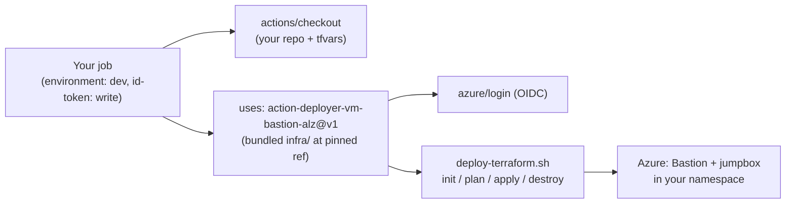

# action-deployer-vm-bastion-alz

This GitHub composite action provisions **Azure Bastion and a Linux jumpbox** in your BC Gov Azure Landing Zone namespace. The action does not require a VPN, public IP addresses, or SSH keys. It uses Microsoft Entra ID with MFA and Azure RBAC.

The repository includes the Terraform configuration. Add the action as a workflow step. Pass the required inputs or a `.tfvars` file. The action deploys the resources to your subscription. You do not need to copy or maintain the Terraform configuration.

## Table of contents

- [Important: One Bastion per VNet](#one-bastion-per-vnet)
- [How it works](#how-it-works)
- [Quick start](#quick-start)
  - [Initial setup for each environment](#initial-setup-for-each-environment)
  - [Wire up the workflow](#wire-up-the-workflow)
- [Configuration: tfvars + override inputs](#configuration-tfvars--override-inputs)
- [Network configuration](#network-configuration)
- [Inputs](#inputs)
- [Jumpbox access (VM Admin Login)](#jumpbox-access-vm-admin-login)
- [Operations](#operations)
- [What gets deployed](#what-gets-deployed)
- [VM image and placement](#vm-image-and-placement)
- [Start/stop schedules](#startstop-schedules)
- [Bastion session options](#bastion-session-options)
- [Monitoring (optional Log Analytics)](#monitoring-optional-log-analytics)
- [Repository structure](#repository-structure)
- [Admin setup (this repo)](#admin-setup-this-repo)
- [Local deployment](#local-deployment)
  - [One-step local deploy](#one-step-local-deploy)
  - [Prerequisites](#prerequisites)
  - [Required Azure permissions](#required-azure-permissions)
  - [Step-by-step local deployment](#step-by-step-local-deployment)
  - [Local vs GitHub Actions differences](#local-vs-github-actions-differences)
  - [Local tfvars fields](#local-tfvars-fields)
  - [Useful local commands](#useful-local-commands)

<!-- markdownlint-disable-next-line MD033 -->
## <a id="one-bastion-per-vnet"></a>Important: One Bastion per VNet

The following constraints apply when multiple namespaces share a spoke VNet.

**1. Use only one `AzureBastionSubnet` per VNet.** Azure Bastion requires this exact subnet name. A VNet can have only one subnet with this name. This action always creates the subnet. If another namespace already owns it, deployment fails. Use a separate spoke VNet. In BC Gov ALZ, each license plate normally has its own VNet.

**2. Jumpbox subnet names must be unique per VNet.** The default is `jumpbox-subnet`. If another namespace already claimed that name, override it:

```yaml
# In the caller workflow:
- uses: bcgov/action-deployer-vm-bastion-alz@v1
  with:
    jumpbox_subnet_name: myapp-jumpbox-subnet   # unique per namespace
    ...
```

Or set the name in your `tfvars_file`:

```hcl
jumpbox_subnet_name = "myapp-jumpbox-subnet"
```

## How it works


```mermaid
flowchart LR
  job["Your job<br/>(environment: dev, id-token: write)"] --> co["actions/checkout<br/>(your repo + tfvars)"]
  job --> act["uses: action-deployer-vm-bastion-alz@v1<br/>(bundled infra/ at pinned ref)"]
  act --> oidc["azure/login (OIDC)"]
  act --> tf["deploy-terraform.sh<br/>init / plan / apply / destroy"]
  tf --> az["Azure: Bastion + jumpbox<br/>in your namespace"]
```

Your job checks out its repository. The action then reads the `tfvars_file` from that checkout. The action includes the `infra/` directory at the pinned `@ref`, so it does not need a second checkout. The action uses the job's `environment:` and `id-token` permission. Environment-scoped secrets therefore resolve as expected. The action signs in with OIDC and runs `deploy-terraform.sh` against a remote state backend in your subscription.

## Quick start

### Initial setup for each environment

Run the BC Gov ALZ OIDC bootstrap **once per environment** in your repository and subscription. The script creates the managed identity, OIDC federated credential, and Terraform state storage account. It can also create the GitHub Environment, its secrets, and the `STORAGE_ACCOUNT_NAME` variable:

```bash
curl -sSLO https://raw.githubusercontent.com/bcgov/quickstart-azure-containers/refs/heads/main/initial-azure-setup.sh
chmod +x initial-azure-setup.sh

# Preview first (recommended), then run for real per environment:
./initial-azure-setup.sh -g "<LICENSEPLATE>-dev-networking" -n "my-app-dev-identity" \
  -r "bcgov/my-app" -e "dev" --create-storage --create-github-secrets --dry-run
```

The script creates:

- **OIDC federated credential** scoped to `repo:<owner>/<repo>:environment:<env>`. Only jobs that run in that GitHub Environment can authenticate.
- **Environment secrets**: `AZURE_CLIENT_ID`, `AZURE_TENANT_ID`, `AZURE_SUBSCRIPTION_ID`, `VNET_NAME`, `VNET_RESOURCE_GROUP_NAME`.
- **Environment variable**: `STORAGE_ACCOUNT_NAME` (the Terraform state storage account).

> **Add these four secrets manually.** The bootstrap does not create `VNET_ADDRESS_SPACE`, `BASTION_SUBNET_ADDRESS_PREFIX`, `JUMPBOX_SUBNET_ADDRESS_PREFIX`, or `VM_ADMIN_LOGIN_PRINCIPAL_IDS`. All four secrets are required. Add them to the same GitHub Environment.

### Wire up the workflow

1. (Optional) Commit a `.tfvars` file. Copy [`examples/team.tfvars`](examples/team.tfvars).
2. Add a caller workflow. Copy [`examples/caller-deploy.yml`](examples/caller-deploy.yml).

Minimal caller:

```yaml
on:
  workflow_dispatch:
    inputs:
      environment:
        type: choice
        options: [dev, test, prod, tools]

jobs:
  deploy:
    runs-on: ubuntu-24.04
    environment: ${{ inputs.environment }} # Selects the GitHub Environment
    permissions:
      id-token: write # OIDC
      contents: read
    steps:
      - uses: actions/checkout@v6 # Checks out the repository so the action can read tfvars_file
      - uses: bcgov/action-deployer-vm-bastion-alz@v1
        with:
          app_name: my-app
          app_env: ${{ inputs.environment }}
          tfvars_file: ./config/my-app.tfvars
          backend_storage_account: ${{ vars.STORAGE_ACCOUNT_NAME }}
          azure_client_id: ${{ secrets.AZURE_CLIENT_ID }}
          azure_tenant_id: ${{ secrets.AZURE_TENANT_ID }}
          azure_subscription_id: ${{ secrets.AZURE_SUBSCRIPTION_ID }}
          vnet_name: ${{ secrets.VNET_NAME }}
          vnet_resource_group_name: ${{ secrets.VNET_RESOURCE_GROUP_NAME }}
          vnet_address_space: ${{ secrets.VNET_ADDRESS_SPACE }}
          bastion_subnet_address_prefix: ${{ secrets.BASTION_SUBNET_ADDRESS_PREFIX }}
          jumpbox_subnet_address_prefix: ${{ secrets.JUMPBOX_SUBNET_ADDRESS_PREFIX }}
          vm_admin_login_principal_ids: ${{ secrets.VM_ADMIN_LOGIN_PRINCIPAL_IDS }}
```

> **Set `environment:` on the job, not on the action.** This setting enables OIDC trust and environment-scoped secrets. Grant `permissions: id-token: write` on the job. GitHub masks secret values that you pass as `with:` inputs.
>
> **Pin a version** with a tag or SHA, for example `...@v1`. The bundled Terraform uses the same ref. Plan and apply therefore use the same configuration.

After deployment, read the [SOCKS proxy consumer guide](bastion-consumer-scripts/bastion-proxy.md) to connect to the private network without a VPN.

## Configuration: tfvars + override inputs

You can configure a deployment in two ways. You can use either method or both methods:

- **`tfvars_file`**: A `.tfvars` file in your checked-out repository, for example `config/my-app.tfvars`. The action uses this file as the base configuration. If the path does not exist, the action stops. A missing `actions/checkout` step is a common cause.
- **Override inputs**: Common inputs include `location`, `vm_size`, `bastion_sku`, `enable_bastion`, `enable_jumpbox`, `enable_bastion_automation`, and `os_disk_size_gb`. These inputs take precedence over the same values in your `.tfvars` file.

Input precedence is `override inputs > tfvars_file > TF_VAR_* defaults`.

Use `tfvars_file` for other settings. The action exposes only the most common settings as inputs. The full variable set is in [`infra/variables.tf`](infra/variables.tf). You can set the other variables only through a `.tfvars` file. For example, the action does not expose schedule times as inputs.

## Network configuration

The action creates two subnets inside your **existing** spoke VNet, which the platform
team owns. It creates a jumpbox subnet and `AzureBastionSubnet`. The action always
creates both subnets. If `enable_bastion` is `false`, the action skips only the Bastion
host resource.

| Variable | Required | Notes |
| --- | --- | --- |
| `vnet_name` | yes (secret) | Existing spoke VNet. |
| `vnet_resource_group_name` | yes (secret) | Resource group of the VNet. |
| `vnet_address_space` | yes (secret) | CIDR of the VNet. |
| `bastion_subnet_address_prefix` | yes (secret) | CIDR for `AzureBastionSubnet`. **Use a prefix length of `/26` or less.** |
| `jumpbox_subnet_address_prefix` | yes (secret) | CIDR for the jumpbox subnet. |
| `bastion_subnet_name` | no | Must stay `AzureBastionSubnet` (Azure requirement). |
| `jumpbox_subnet_name` | no | Defaults to `jumpbox-subnet`. **Set a unique value per namespace.** |

> **Validation.** Terraform validates all CIDR values. It requires a prefix length of `/26` or less for `bastion_subnet_address_prefix`. It requires `bastion_subnet_name` to remain `AzureBastionSubnet`. It also checks that both subnet prefixes fit inside the VNet address space returned by Azure. Terraform reports stale secrets and invalid CIDRs during `plan`, before resource creation.

## Inputs

Pass all inputs through `with:`. Pass `azure_*`, `vnet_*`, and
`vm_admin_login_principal_ids` from **secrets**. GitHub masks these values in logs.
Pass `backend_storage_account` from the `STORAGE_ACCOUNT_NAME` variable that the
bootstrap creates.

| Input | Required | Default | Description |
| --- | --- | --- | --- |
| `app_name` | yes | not set | Application name. The action uses it for resource names and the state key. |
| `app_env` | yes | not set | Environment, such as `tools`, `dev`, `test`, or `prod`. |
| `terraform_command` | no | `apply` | `apply`, `plan`, or `destroy`. |
| `tfvars_file` | no | `""` | Path in your checked-out repo to a `.tfvars` file. |
| `location` | no | `""` | Azure region override. |
| `resource_group_name` | no | `<app_name>-<app_env>` | Resource group name override. |
| `vm_size` | no | `""` | Jumpbox VM size override. |
| `os_disk_size_gb` | no | `""` | Jumpbox OS disk size override. |
| `bastion_sku` | no | `""` | Bastion SKU override (`Standard`/`Premium`). |
| `jumpbox_subnet_name` | no | `jumpbox-subnet` | Name of the jumpbox subnet. **It must be unique within the VNet.** Override it when another namespace uses the default name. |
| `enable_bastion` | no | `""` | Deploy Bastion host (`true`/`false`). Note: `AzureBastionSubnet` is always created regardless. |
| `enable_jumpbox` | no | `""` | Deploy jumpbox (`true`/`false`). |
| `enable_bastion_automation` | no | `""` | Bastion delete/recreate automation (`true`/`false`). |
| `enable_monitoring` | no | `""` | Create/attach a Log Analytics Workspace + Bastion audit logs. Set `false` to skip. |
| `existing_log_analytics_workspace_id` | no | `""` | Resource ID of an existing Log Analytics workspace. When set, the action does not create a workspace. |
| `backend_storage_account` | yes | not set | Storage account for Terraform state. Pass `${{ vars.STORAGE_ACCOUNT_NAME }}`. |
| `backend_resource_group` | no | `vnet_resource_group_name` | Resource group of the state storage account. |
| `backend_container_name` | no | `tfstate` | Blob container for state. |
| `backend_state_key` | no | `<app_name>/<app_env>/terraform.tfstate` | State blob key. |
| `azure_client_id` | yes | not set | OIDC application client ID. Pass it from a secret. |
| `azure_tenant_id` | yes | not set | Microsoft Entra tenant ID. Pass it from a secret. |
| `azure_subscription_id` | yes | not set | Target subscription ID. Pass it from a secret. |
| `vnet_name` | yes | not set | Existing spoke VNet name. Pass it from a secret. |
| `vnet_resource_group_name` | yes | not set | Resource group of the existing VNet. Pass it from a secret. |
| `vnet_address_space` | yes | not set | Address space of the VNet, for example `10.46.115.0/24`. Pass it from a secret. |
| `bastion_subnet_address_prefix` | yes | not set | CIDR for `AzureBastionSubnet`, for example `10.46.115.64/26`. Use a prefix length of `/26` or less. Pass it from a secret. |
| `jumpbox_subnet_address_prefix` | yes | not set | CIDR for the jumpbox subnet, for example `10.46.115.128/28`. Pass it from a secret. |
| `vm_admin_login_principal_ids` | yes | not set | Comma-separated Microsoft Entra object IDs for users or groups that need jumpbox login. Pass it from a secret. See [Jumpbox access](#jumpbox-access-vm-admin-login). |

> **Store network inputs in secrets.** Pass VNet names and CIDRs from GitHub Environment secrets. Do not put these values in workflow files or committed `.tfvars` files.

### Secrets created by the bootstrap

The [initial setup](#initial-setup-for-each-environment) script creates the following environment secrets and variables. Map them to action inputs as shown in the caller example:

| GitHub item | Kind | Created by bootstrap | Maps to input |
| --- | --- | --- | --- |
| `AZURE_CLIENT_ID` | secret | yes | `azure_client_id` |
| `AZURE_TENANT_ID` | secret | yes | `azure_tenant_id` |
| `AZURE_SUBSCRIPTION_ID` | secret | yes | `azure_subscription_id` |
| `VNET_NAME` | secret | yes | `vnet_name` |
| `VNET_RESOURCE_GROUP_NAME` | secret | yes | `vnet_resource_group_name` |
| `STORAGE_ACCOUNT_NAME` | variable | yes | `backend_storage_account` |
| `VNET_ADDRESS_SPACE` | secret | **No. Add manually.** | `vnet_address_space` |
| `BASTION_SUBNET_ADDRESS_PREFIX` | secret | **No. Add manually.** | `bastion_subnet_address_prefix` |
| `JUMPBOX_SUBNET_ADDRESS_PREFIX` | secret | **No. Add manually.** | `jumpbox_subnet_address_prefix` |
| `VM_ADMIN_LOGIN_PRINCIPAL_IDS` | secret | **No. Add manually.** | `vm_admin_login_principal_ids` |

## Jumpbox access (VM Admin Login)

Azure RBAC controls access to the jumpbox. The action assigns the **Virtual Machine Administrator Login** role to each principal in `VM_ADMIN_LOGIN_PRINCIPAL_IDS`. At least one principal is required. An empty list gives nobody access. The action stops before deployment when the list is empty.

`VM_ADMIN_LOGIN_PRINCIPAL_IDS` is a **comma-separated string of Microsoft Entra object IDs** (GUIDs). You can specify users or groups. Do not include brackets or quotation marks. Use a group to manage access in Microsoft Entra ID instead of CI. Use object IDs only. The action rejects UPNs, email addresses, and display names.

Use the Azure CLI to find object IDs:

```bash
# Get a user object ID from a sign-in name
az ad user show --id alice@example.gov.bc.ca --query id -o tsv

# Get a group object ID from a display name
az ad group show --group "My Team Jumpbox Admins" --query id -o tsv
```

Examples:

| Grant access to | `VM_ADMIN_LOGIN_PRINCIPAL_IDS` |
| --- | --- |
| one group (recommended) | `aaaaaaaa-aaaa-aaaa-aaaa-aaaaaaaaaaaa` |
| two users | `1111...-1111,2222...-2222` |
| a group + a break-glass user | `aaaaaaaa-...,99999999-...` |

## Operations

Use `terraform_command` to select the operation:

- `apply` creates or updates resources. Terraform auto-approves this operation in CI.
- `plan` previews changes. It does not change Azure resources.
- `destroy` removes the namespace resources. Terraform auto-approves this operation in CI.

## What gets deployed

| Component | Purpose |
| --- | --- |
| Azure Bastion (Standard) | Native client tunneling for Microsoft Entra-authenticated SSH |
| Ubuntu jumpbox VM | Minimal Linux host, no public IP, Microsoft Entra SSH login |
| RBAC assignments | VM Admin / User Login for configured Microsoft Entra principals |
| Auto-shutdown and auto-start | DevTest schedule and Automation runbook |
| Log Analytics workspace | Optional. The action creates one by default for the Bastion audit trail. You can use an existing workspace or disable monitoring. |
| Update Manager assessment | Patch compliance visibility |

See [`infra/`](infra/) for the layout. The action provisions the Bastion host and jumpbox VM with [Azure Verified Modules](https://aka.ms/avm): `avm-res-network-bastionhost` and `avm-res-compute-virtualmachine`. The local `network`, `jumpbox`, and `monitoring` modules create the subnets, NSGs, Automation runbooks, and Log Analytics resources. See [`infra/variables.tf`](infra/variables.tf) for the full variable set.

## VM image and placement

Two additional `.tfvars` settings control the jumpbox image and availability zone:

| Setting | Effect | Default |
| --- | --- | --- |
| `vm_image` | Source image with `publisher`, `offer`, `sku`, and `version`. Pin `version` for reproducible builds. | latest Ubuntu 24.04 LTS server |
| `availability_zone` | Pin the VM **and** Bastion to a zone (`"1"`/`"2"`/`"3"`) | `null` (non-zonal) |

```hcl
vm_image = {
  publisher = "Canonical"
  offer     = "ubuntu-24_04-lts"
  sku       = "server"
  version   = "24.04.202405300" # pin instead of "latest"
}
availability_zone = "1"
```

> Changing either setting replaces affected resources. A new image version replaces the VM. A zone change replaces both the VM and Bastion. Plan a maintenance window before you change either setting.

## Start/stop schedules

By default, the jumpbox deallocates overnight and restarts on a schedule. You can also delete Bastion after hours and recreate it on the next working day to reduce cost. Set all schedule times through `tfvars_file`. The action does not expose schedule times as inputs.

| Schedule | Effect | Default | Variables |
| --- | --- | --- | --- |
| VM auto-shutdown | Deallocates the jumpbox daily | 01:00 daily (UTC) | `vm_auto_shutdown_enabled`, `vm_auto_shutdown_time`, `vm_auto_shutdown_timezone`, `vm_auto_shutdown_notification` |
| VM auto-start | Restarts the jumpbox on working days | 16:00 UTC, Mon-Fri | `vm_auto_start_time_utc`, `auto_start_week_days` |
| Bastion recreation\* | Recreates Bastion on working days | 16:00 UTC, Mon-Fri | `bastion_create_time_utc`, `auto_start_week_days` |
| Bastion deletion\* | Deletes Bastion after hours | 01:00 UTC daily | `bastion_delete_time_utc` |

\* The Bastion deletion and recreation schedules run only when `enable_bastion_automation = true`.

A few format notes:

- **Auto-shutdown** (`vm_auto_shutdown_time`) uses 24-hour `HHmm` with no colon. The value uses a **Windows** time-zone name such as `Pacific Standard Time`. Set `vm_auto_shutdown_enabled = false` to disable this schedule.
- **Automation schedules** use UTC in `HH:MM:SS` format. This includes VM start and Bastion deletion or recreation. The `auto_start_week_days` setting applies to both schedules. Use full English weekday names.
- **Pre-shutdown notification** is disabled by default. Set `vm_auto_shutdown_notification = { enabled = true, email = "you@example.com", minutes_before = 15 }` to enable it.

This example starts the VM later in the day, runs schedules from Monday through Saturday, and shuts down the VM at 6:00 PM local time:

```hcl
vm_auto_start_time_utc    = "14:00:00"
bastion_create_time_utc   = "14:00:00"
bastion_delete_time_utc   = "02:00:00"
auto_start_week_days      = ["Monday", "Tuesday", "Wednesday", "Thursday", "Friday", "Saturday"]
vm_auto_shutdown_time     = "1800"                  # 6:00 PM
vm_auto_shutdown_timezone = "Pacific Standard Time" # Local time
```

## Bastion session options

Azure Bastion session features are available only through `.tfvars` settings. The action does not expose them as inputs. The settings apply to **both** the active Bastion and any Bastion that automation recreates. Both configurations therefore stay in sync:

| Setting | Effect | Default |
| --- | --- | --- |
| `bastion_tunneling_enabled` | Native client tunneling (required for the SOCKS proxy) | `true` |
| `bastion_copy_paste_enabled` | Clipboard copy/paste in sessions | `true` |
| `bastion_file_copy_enabled` | File copy in sessions | `false` |
| `bastion_ip_connect_enabled` | Connect to a target by IP | `false` |
| `bastion_shareable_link_enabled` | Shareable session links | `false` |
| `bastion_scale_units` | Bastion scale units (instances) | `2` |

Tunneling, file copy, IP connect, and shareable links require the **Standard** or **Premium** SKU. `Standard` is the default value for `bastion_sku`. Keep `bastion_tunneling_enabled` set to `true`. The [bastion-proxy](bastion-consumer-scripts/bastion-proxy.md) script requires tunneling.

## Monitoring (optional Log Analytics)

The Log Analytics workspace stores the Bastion connection audit trail in `BastionAuditLogs`. The audit data identifies who connected, the target VM, and the connection time. The jumpbox does not include a monitoring agent. Monitoring is optional. Bastion and the jumpbox work without a Log Analytics workspace. Choose one of these modes:

| Mode | Set | Result |
| --- | --- | --- |
| **Create (default)** | No setting | The action creates a workspace named `<app_name>-law` and sends Bastion audit logs to it. |
| **Use an existing workspace** | `existing_log_analytics_workspace_id` | The action does not create a workspace. It sends audit logs to the workspace that you specify. |
| **Off** | `enable_monitoring = false` | The action creates no workspace and no Bastion diagnostic setting. |

When the action **creates** a workspace, you can set three `.tfvars` values: `log_analytics_retention_days` (default `30`), `log_analytics_sku` (default `PerGB2018`), and `log_analytics_daily_quota_gb` (daily ingestion cap in GB, default `-1` for no cap). These settings do not apply when you use an existing workspace.

Use the full resource ID, **not** only the workspace GUID:

```hcl
existing_log_analytics_workspace_id = "/subscriptions/<sub>/resourceGroups/<rg>/providers/Microsoft.OperationalInsights/workspaces/<name>"
```

You can also pass the resource ID as an action input:

```yaml
with:
  existing_log_analytics_workspace_id: /subscriptions/<sub>/resourceGroups/<rg>/providers/Microsoft.OperationalInsights/workspaces/<name>
```

> **Use the full resource ID, not only the GUID.** Terraform validates this value. It stops early if you provide only a GUID.
>
> **An existing workspace requires RBAC.** It does not require a workspace key. Grant the deploying identity **Monitoring Contributor** or **Log Analytics Contributor** at the workspace scope when the workspace is in another resource group or subscription.

## Repository structure

```text
.
├── action.yml                       # Composite action (entry point)
├── .github/
│   ├── workflows/
│   │   ├── validate.yml               # PR gate: terraform fmt/validate + tflint + PSScriptAnalyzer
│   │   ├── release.yml                # Tag + GitHub Release on push to main
│   │   └── dependabot-auto-merge.yml  # Auto-approve + merge Dependabot PRs
│   ├── scripts/
│   │   ├── run-deploy.sh              # Action entry point (stage tfvars, overrides, run)
│   │   └── setup-repo-protection.sh   # Harden repository with gh api (admins)
│   └── dependabot.yml
├── infra/                       # Bundled Terraform (Bastion + jumpbox + ...)
│   ├── main.tf                  # Root: RG + Bastion (AVM) + network/monitoring/jumpbox modules
│   ├── deploy-terraform.sh      # init/plan/apply/destroy orchestration (Bash; also runs in CI)
│   ├── deploy-terraform.ps1     # Same orchestration for local use (PowerShell; local only)
│   └── modules/                 # network, jumpbox (VM via AVM), monitoring
├── bastion-consumer-scripts/    # Hand to teams to reach the jumpbox via Bastion
│   ├── bastion-proxy.sh         # SOCKS5 proxy tunnel (macOS/Linux/Git Bash)
│   ├── bastion-proxy.ps1        # SOCKS5 proxy tunnel (Windows PowerShell)
│   └── bastion-proxy.md         # Consumer-facing usage guide
├── examples/
│   ├── caller-deploy.yml        # Copy into your repo's workflows
│   ├── team.tfvars              # Copy + edit for your config (GitHub Actions)
│   └── local.tfvars             # Copy to infra/terraform.tfvars for local use
└── README.md
```

## Admin setup (this repo)

Repository maintainers run a script once to enable merge automation. The script
uses the GitHub CLI (`gh`). You need administrator rights on the repository:

```bash
gh auth login
./.github/scripts/setup-repo-protection.sh
```

The script enables repository auto-merge with squash-only merges and branch deletion
after merge. It also applies branch protection to `main`. The protection requires one
approval, a linear history, and resolved conversations. It prevents force pushes and
branch deletion. Combined with
[`dependabot-auto-merge.yml`](.github/workflows/dependabot-auto-merge.yml), the repository
automatically approves and merges patch and minor Dependabot pull requests after checks
pass. A human must review major updates. Set environment variables to change the
defaults. For example:

```bash
REVIEW_COUNT=2 REQUIRED_CHECKS="terraform-validate,lint" \
  ./.github/scripts/setup-repo-protection.sh
```

## Local deployment

The same Terraform configuration that CI runs is available on a developer workstation.
Use it for ad hoc deployments, troubleshooting, or testing before you create a workflow.
Both scripts use Azure CLI authentication instead of OIDC:

- **`infra/deploy-terraform.sh`** (Bash): macOS, Linux, Git Bash, or WSL2. CI also runs this script.
- **`infra/deploy-terraform.ps1`** (PowerShell): native Windows PowerShell 5.1 or PowerShell 7+. You do not need Git Bash or WSL2.

The following commands are shown for both shells. Use the commands for your shell.

### One-step local deploy

The `deploy-terraform.ps1 deploy` command combines the five manual steps below. It installs
Terraform, the Azure CLI, and Git when they are missing. It signs in to Azure when needed.
It then runs `terraform init` and `terraform apply` against a `terraform.tfvars` file.
The file can live **anywhere on disk**. It does not have to be `infra/terraform.tfvars`.

```powershell
.\infra\deploy-terraform.ps1 deploy -TfvarsPath 'C:\path\to\my.tfvars' -Mode local
```

- **`-TfvarsPath`** specifies the path to your filled-in copy of [`examples/local.tfvars`](examples/local.tfvars). The file can be anywhere on disk.
- **`-Mode local`** states that the command runs in local mode. This option does not force local Terraform state. See the backend note below. The command prints the selected mode at the start of each `deploy` run.
- **Backend**: When `BACKEND_RESOURCE_GROUP`, `BACKEND_STORAGE_ACCOUNT`, and `BACKEND_STATE_KEY` are set, `deploy` uses the shared `azurerm` backend that CI uses. When any value is missing, the command uses **local Terraform state** in `infra/terraform.tfstate` on this machine. The command prints a warning. Do not use this fallback for team or shared deployments.
- **The command stops when the backend changes.** `deploy` records the last backend that it used. If the backend changes from local to `azurerm`, or from `azurerm` to local, the command stops and prints migration instructions. Terraform's `-reconfigure` option *discards* the link to existing state instead of migrating it. Automatic continuation could strand the old state and cause the next apply to recreate resources that already exist. To move state deliberately:

  ```powershell
  terraform -chdir=infra init -migrate-state -backend-config=resource_group_name=... -backend-config=storage_account_name=... -backend-config=container_name=... -backend-config=key=...
  ```

- The command asks for one confirmation: Terraform's interactive `yes` prompt. `deploy` never passes `-auto-approve`. **`deploy` refuses to run when `CI=true`** because no pipeline can answer the prompt. Use `init` and `apply` in CI. CI auto-approves those operations.

#### Run directly from GitHub without a clone

The `deploy` and `destroy` commands also work when you download only this script. You do not
need to run `git clone`. Git does not need to be installed before you start. The script installs
Git when needed, then uses Git to fetch the Terraform configuration.
**Run the command from an elevated ("Run as Administrator") PowerShell session.** A machine-wide
installation of Terraform, the Azure CLI, or Git can require administrator rights.

First, download a `.tfvars` template. You do not need to clone the repository:

```powershell
Invoke-WebRequest -Uri 'https://raw.githubusercontent.com/bcgov/action-deployer-vm-bastion-alz/main/examples/local.tfvars' -OutFile my.tfvars
# Edit my.tfvars. Replace every REPLACE_ME placeholder.
```

Next, download and run `deploy-terraform.ps1`:

```powershell
# PowerShell 7 (pwsh) -- run as Administrator
$tmp = Join-Path ([System.IO.Path]::GetTempPath()) 'deploy-terraform.ps1'
Invoke-WebRequest -Uri 'https://raw.githubusercontent.com/bcgov/action-deployer-vm-bastion-alz/main/infra/deploy-terraform.ps1' -OutFile $tmp
try {
  pwsh -ExecutionPolicy Bypass -File $tmp deploy -TfvarsPath 'C:\path\to\my.tfvars' -Mode local
}
finally {
  Remove-Item $tmp -Force -ErrorAction SilentlyContinue
}
```

```powershell
# Windows PowerShell 5.1 -- run as Administrator
$tmp = Join-Path $env:TEMP 'deploy-terraform.ps1'
Invoke-WebRequest -Uri 'https://raw.githubusercontent.com/bcgov/action-deployer-vm-bastion-alz/main/infra/deploy-terraform.ps1' -OutFile $tmp
try {
  powershell.exe -ExecutionPolicy Bypass -File $tmp deploy -TfvarsPath 'C:\path\to\my.tfvars' -Mode local
}
finally {
  Remove-Item $tmp -Force -ErrorAction SilentlyContinue
}
```

On the first run, the script clones the repository into
`%LOCALAPPDATA%\bcgov\action-deployer-vm-bastion-alz\<ref>\`. The script installs Git when it is
missing. Later standalone `deploy` and `destroy` runs reuse this checkout. Local-state runs also
reuse the Terraform state in this checkout. The script serializes concurrent runs against the
same checkout. Two shells therefore cannot change the same checkout or backend state at once.

To destroy a deployment created this way, run the downloaded script with `destroy`. Use the same
`-TfvarsPath` and `-Ref` values that you used for `deploy`. The `-Ref` value identifies the cache
directory. A different ref uses a different local state file. When both commands omit `-Ref`,
the commands use the default `main` cache.

**Pin a version.** `-Ref` defaults to `main`. The `main` branch can change, so the same command
can deploy different infrastructure on different days. The script warns when it uses `main`.
Use `-Ref v1` or another released tag to pin the version. The script validates refs. It rejects
values that could be read as a Git option or escape the cache directory.

> **Why use an elevated PowerShell session?** WinGet, Chocolatey, and direct-download installers
> can write Terraform, the Azure CLI, and Git to machine-wide locations such as `Program Files`.
> These installations normally require administrator rights. A non-elevated session works when
> the tools are already installed or when your WinGet installations use a per-user scope.

### Prerequisites

Install the following tools before running locally:

| Tool | Minimum version | Install guide |
| --- | --- | --- |
| [Azure CLI](https://learn.microsoft.com/en-us/cli/azure/install-azure-cli) | 2.65+ | See the platform instructions below. **On Windows, `deploy-terraform.ps1` installs it when missing.** Manual installation is optional. |
| [Terraform](https://developer.hashicorp.com/terraform/install) | 1.12+ | See the platform instructions below. **On Windows, `deploy-terraform.ps1` installs it when missing.** Manual installation is optional. |
| [Git](https://git-scm.com/downloads) | 2.x | Git is pre-installed on macOS and Linux. **`deploy-terraform.ps1 deploy` and `destroy` install it when missing** for standalone runs without a local checkout. Other commands require a cloned repository. |
| A shell | not applicable | macOS and Linux require **Bash 4.x or later**. Windows uses **PowerShell** 5.1 or later to run `deploy-terraform.ps1`. Use Git Bash or WSL2 only when you want to run the `.sh` script. |

> **Windows auto-install.** `infra/deploy-terraform.ps1` checks for Terraform and the Azure
> CLI on every run. It also checks for Git during standalone `deploy` or `destroy` runs. See
> [One-step local deploy](#one-step-local-deploy). The script installs missing tools with
> WinGet, Chocolatey, or a direct download. It uses the same installation pattern as
> [`bastion-proxy.ps1`](bastion-consumer-scripts/bastion-proxy.ps1). The script tries each
> method in order until the tool is available on `PATH`. It then continues to the next method
> when a method is unavailable or fails. You can skip the manual installation steps below and
> run the script. The script prints each installation step.
>
> **Direct downloads are verified before use.** The script checks the Terraform zip against
> HashiCorp's published `SHA256SUMS`. It checks the Azure CLI MSI and Git installer against their
> Authenticode signatures. A mismatch stops that installation method before the script runs the
> file.

Verify after installing:

```bash
# macOS / Linux / Git Bash
az version         # must show "azure-cli": "2.65.0" or higher
terraform version  # must show Terraform v1.12.x or higher
bash --version     # Bash 4.x or later is required. macOS ships Bash 3.2. Install via Homebrew.
```

```powershell
# Windows PowerShell
az version                  # must show "azure-cli": "2.65.0" or higher
terraform version           # must show Terraform v1.12.x or higher
$PSVersionTable.PSVersion   # 5.1+ (Windows PowerShell) or 7.x (pwsh) both work
```

#### macOS (Homebrew)

```bash
brew update
brew install azure-cli
brew tap hashicorp/tap && brew install hashicorp/tap/terraform
brew install bash          # macOS ships Bash 3.2; deploy-terraform.sh requires 4+
```

#### Windows (winget)

Optional. `infra/deploy-terraform.ps1` installs both tools automatically on the first run when
they are missing. Install them manually when you want them available before the first run:

```powershell
winget install Microsoft.AzureCLI
winget install HashiCorp.Terraform
```

Run deploy commands with `infra/deploy-terraform.ps1` in **PowerShell**. Windows PowerShell
5.1 and PowerShell 7 or later are supported. You do not need Git Bash or WSL2. To run the Bash
script (`infra/deploy-terraform.sh`), install Git for Windows. Git for Windows includes Git Bash:

```powershell
winget install Git.Git
```

#### Linux (apt / manual)

```bash
# Azure CLI
curl -sL https://aka.ms/InstallAzureCLIDeb | sudo bash

# Download the Terraform binary for your architecture.
TERRAFORM_VERSION=1.12.0
curl -fsSL "https://releases.hashicorp.com/terraform/${TERRAFORM_VERSION}/terraform_${TERRAFORM_VERSION}_linux_amd64.zip" -o tf.zip
unzip tf.zip && sudo mv terraform /usr/local/bin/ && rm tf.zip
```

### Required Azure permissions

Your Azure account needs the following RBAC roles on the target subscription:

| Role | Scope | Purpose |
| --- | --- | --- |
| **Contributor** | Target subscription | Create resource group, VM, Bastion, Automation Account, etc. |
| **User Access Administrator** | Target subscription | Assign RBAC roles (VM Admin Login) to Entra principals |
| **Network Contributor** | VNet resource group | Create subnets in the existing spoke VNet |

> The **Owner** role on the subscription includes all three roles. For least privilege, scope **Network Contributor** to the VNet resource group instead of the whole subscription.

### Step-by-step local deployment

Use [One-step local deploy](#one-step-local-deploy) when you want one command. It automates the five steps below. Use the manual steps when you need more control or need to troubleshoot.

#### 1. Clone the repository at a specific version

```bash
git clone https://github.com/bcgov/action-deployer-vm-bastion-alz.git
cd action-deployer-vm-bastion-alz
git checkout v1          # Pin to a release tag such as v1 or v1.2.3, or to a commit SHA
```

#### 2. Log in to Azure

```bash
# Sign in. Use --tenant <tenant-id> to target a specific Microsoft Entra tenant.
az login

# Select the target subscription.
az account set --subscription "<your-subscription-id>"

# Verify the selected subscription.
az account show --query "[name, id]" -o tsv
```

#### 3. Create a local tfvars file

```bash
# macOS / Linux / Git Bash
cp examples/local.tfvars infra/terraform.tfvars
# Edit infra/terraform.tfvars. Replace every REPLACE_ME placeholder.
```

```powershell
# Windows PowerShell
Copy-Item examples/local.tfvars infra/terraform.tfvars
# Edit infra/terraform.tfvars. Replace every REPLACE_ME placeholder.
```

Git ignores `infra/terraform.tfvars`. Do not commit subscription IDs, VNet names, or principal IDs. See the [local vs GitHub Actions differences table](#local-vs-github-actions-differences) for the value required in each field.

#### 4. Set backend environment variables

```bash
# macOS / Linux / Git Bash
export BACKEND_RESOURCE_GROUP="<resource-group-of-storage-account>"
export BACKEND_STORAGE_ACCOUNT="<storage-account-name>"    # From STORAGE_ACCOUNT_NAME in GitHub Actions
export BACKEND_STATE_KEY="my-app/tools/terraform.tfstate"  # must match the key used in CI
# BACKEND_CONTAINER_NAME defaults to "tfstate". Override if your container differs.
```

```powershell
# Windows PowerShell
$env:BACKEND_RESOURCE_GROUP = "<resource-group-of-storage-account>"
$env:BACKEND_STORAGE_ACCOUNT = "<storage-account-name>"    # From STORAGE_ACCOUNT_NAME in GitHub Actions
$env:BACKEND_STATE_KEY = "my-app/tools/terraform.tfstate"  # must match the key used in CI
# BACKEND_CONTAINER_NAME defaults to "tfstate". Override if your container differs.
```

Use the storage account that `initial-azure-setup.sh` created. A shared backend makes local and CI deployments use the same state file.

> **Set these variables for every command except `deploy`, `fmt`, `validate`, and PowerShell
> `destroy`.** If the variables are unset, `deploy-terraform.ps1 destroy` creates the local
> backend override and uses `infra/terraform.tfstate` on this machine. Other commands stop
> instead of initializing with an empty backend configuration. Set the three variables or use
> [`deploy`](#one-step-local-deploy), which intentionally uses local state when the variables are
> missing.
>
> The script also checks the reverse case. If a previous `deploy` left
> `infra/local_backend_override.tf` in place and `BACKEND_*` is now set, the settings disagree.
> The script refuses to run instead of silently using local state. Every command prints the
> active backend before it performs another action.

#### 5. Plan and apply

```bash
# macOS / Linux / Git Bash
./infra/deploy-terraform.sh plan     # Preview changes. Do not change Azure resources.
./infra/deploy-terraform.sh apply    # Deploy. The script asks for confirmation locally.
./infra/deploy-terraform.sh destroy  # Remove resources. The script asks for confirmation.
```

```powershell
# Windows PowerShell
.\infra\deploy-terraform.ps1 plan     # Preview changes. Do not change Azure resources.
.\infra\deploy-terraform.ps1 apply    # Deploy. The script asks for confirmation locally.
.\infra\deploy-terraform.ps1 destroy  # Remove resources. The script asks for confirmation.
```

### Local vs GitHub Actions differences

| Concern | GitHub Actions | Local |
| --- | --- | --- |
| **Authentication** | OIDC federated credential | Azure CLI (`az login`) |
| `use_oidc` | `true` (default) | `false`. Set it in `infra/terraform.tfvars`. |
| `client_id` | Set from OIDC app registration | `""`. It is not required for CLI authentication. |
| **Sensitive variables** | GitHub Environment secrets become `TF_VAR_*` environment variables. | Store all values in `infra/terraform.tfvars` (git-ignored). |
| `vm_admin_login_principal_ids` | Comma-separated string from secret; converted by `run-deploy.sh` | HCL list in tfvars: `["guid1", "guid2"]` |
| `common_tags` | JSON map injected as `TF_VAR_common_tags` env var | HCL map literal in tfvars |
| `resource_group_name` | Defaults to `<app_name>-<app_env>` | Must be set explicitly in tfvars |
| **Auto-approve** | Yes (`CI=true`) | No. The script asks for `yes` before apply or destroy. |
| **State backend** | Set through action inputs. | Set through `BACKEND_*` environment variables. PowerShell `deploy` and `destroy` use local state when the variables are unset (see [One-step local deploy](#one-step-local-deploy)). Other commands require the variables unless a previous local `deploy` switched the directory to local state. The script prints the active backend on every run. |
| **Script logging** | not applicable | `deploy-terraform.ps1` writes `[deploy]` log lines to **stderr**, matching `deploy-terraform.sh`. `... output > file.txt` therefore captures only Terraform output. |

### Local tfvars fields

The [`examples/local.tfvars`](examples/local.tfvars) template includes every required variable with a `REPLACE_ME` placeholder. The following fields differ from [`examples/team.tfvars`](examples/team.tfvars):

| Variable | Value for local | Notes |
| --- | --- | --- |
| `use_oidc` | `false` | Use Azure CLI authentication locally. GitHub Actions uses `true` by default. |
| `client_id` | `""` | Not required for Azure CLI authentication. |
| `subscription_id` | Your subscription GUID | Same value as the `AZURE_SUBSCRIPTION_ID` secret in GitHub Actions. |
| `tenant_id` | Your Microsoft Entra tenant GUID | Same value as the `AZURE_TENANT_ID` secret in GitHub Actions. |
| `resource_group_name` | `"my-app-tools"` | GitHub Actions computes `<app_name>-<app_env>`. Set the value explicitly for local use. |
| `common_tags` | HCL map `{ environment = "..." }` | GitHub Actions injects the value as a JSON environment variable. |
| `vnet_name` | Your VNet name | Same value as `VNET_NAME` GitHub secret |
| `vnet_resource_group_name` | VNet resource group | Same as `VNET_RESOURCE_GROUP_NAME` secret |
| `vnet_address_space` | VNet CIDR | Same as `VNET_ADDRESS_SPACE` secret |
| `bastion_subnet_address_prefix` | CIDR with a prefix length of `/26` or less | Same as `BASTION_SUBNET_ADDRESS_PREFIX` secret |
| `jumpbox_subnet_address_prefix` | Any valid CIDR | Same as `JUMPBOX_SUBNET_ADDRESS_PREFIX` secret |
| `vm_admin_login_principal_ids` | `["guid1", "guid2"]` | HCL list, not a comma-separated string |

> **`vm_admin_login_principal_ids`**: GitHub Actions uses a comma-separated string. `run-deploy.sh` converts the string. For local use, write an HCL list:
>
> ```hcl
> vm_admin_login_principal_ids = ["11111111-1111-1111-1111-111111111111"]
> ```

### Useful local commands

```bash
# macOS / Linux / Git Bash
# Show Terraform outputs after a successful apply
./infra/deploy-terraform.sh output

# Target a specific module, for example re-apply Bastion only
./infra/deploy-terraform.sh apply -target=module.bastion

# Validate syntax and format. No Azure authentication or backend is needed.
./infra/deploy-terraform.sh validate
./infra/deploy-terraform.sh fmt

# List all resources tracked in state
./infra/deploy-terraform.sh state list

# Refresh state from Azure (after out-of-band changes)
./infra/deploy-terraform.sh refresh

# Remove a resource from state without destroying it in Azure
./infra/deploy-terraform.sh state rm <resource.address>
```

```powershell
# Windows PowerShell
# Show Terraform outputs after a successful apply
.\infra\deploy-terraform.ps1 output

# Target a specific module, for example re-apply Bastion only
.\infra\deploy-terraform.ps1 apply -target=module.bastion

# Validate syntax and format. No Azure authentication or backend is needed.
.\infra\deploy-terraform.ps1 validate
.\infra\deploy-terraform.ps1 fmt

# List all resources tracked in state
.\infra\deploy-terraform.ps1 state list

# Refresh state from Azure (after out-of-band changes)
.\infra\deploy-terraform.ps1 refresh

# Remove a resource from state without destroying it in Azure
.\infra\deploy-terraform.ps1 state rm <resource.address>
```

**Connect to the jumpbox after deployment:**

Use the bundled script to open a SOCKS5 proxy tunnel through Azure Bastion. The script installs
the Bastion CLI extension on first use. It starts the jumpbox when auto-shutdown has deallocated
it. It waits for the proxy to become ready. First, sign in with `az login`.

Run these commands from the repository root. Use Terraform outputs and your current Azure
context to obtain the resource names and IDs:

```bash
# macOS / Linux / Git Bash
# Get resource names from Terraform state and subscription and tenant IDs from Azure CLI.
RG="<app_name>-<app_env>"   # For example, my-app-tools
BASTION_NAME="$(cd infra && terraform output -raw bastion_resource_id | sed 's|.*/||')"
VM_NAME="$(cd infra && terraform output -raw jumpbox_vm_id            | sed 's|.*/||')"
SUBSCRIPTION_ID="$(az account show --query id -o tsv)"
TENANT_ID="$(az account show --query tenantId -o tsv)"
```

```powershell
# Windows PowerShell
# Get resource names from Terraform state and subscription and tenant IDs from Azure CLI.
$RG = "<app_name>-<app_env>"   # For example, my-app-tools
Push-Location infra
$BASTION_NAME = (terraform output -raw bastion_resource_id) -replace '.*/', ''
$VM_NAME      = (terraform output -raw jumpbox_vm_id)       -replace '.*/', ''
Pop-Location
$SUBSCRIPTION_ID = az account show --query id -o tsv
$TENANT_ID       = az account show --query tenantId -o tsv
```

**macOS / Linux / Windows (Git Bash)**: [`bastion-consumer-scripts/bastion-proxy.sh`](bastion-consumer-scripts/bastion-proxy.sh)

```bash
./bastion-consumer-scripts/bastion-proxy.sh \
  -g "$RG" \
  -b "$BASTION_NAME" \
  -v "$VM_NAME" \
  -s "$SUBSCRIPTION_ID" \
  -t "$TENANT_ID" \
  -p 8228
```

**Windows (PowerShell)**: [`bastion-consumer-scripts/bastion-proxy.ps1`](bastion-consumer-scripts/bastion-proxy.ps1)

```powershell
.\bastion-consumer-scripts\bastion-proxy.ps1 `
  -ResourceGroup $RG `
  -BastionName $BASTION_NAME `
  -VmName $VM_NAME `
  -SubscriptionId $SUBSCRIPTION_ID `
  -TenantId $TENANT_ID `
  -Port 8228
```

When the tunnel is ready, the script prints the proxy address. Configure your browser or CLI to
use `socks5h://127.0.0.1:8228` to reach private endpoints. The jumpbox resolves and forwards
traffic through the SOCKS5 proxy. You can therefore reach private PaaS endpoints without a VPN.
Pass the starting port with `-p` or `-Port`. In this example, the starting port is `8228`. If
the port is in use, the script selects the next available port and prints it.
